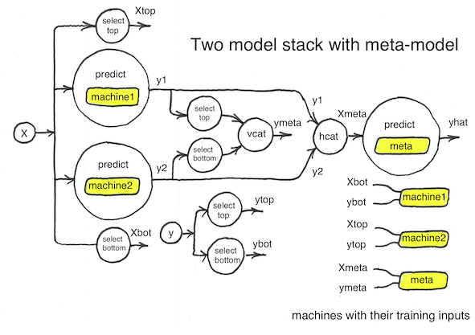
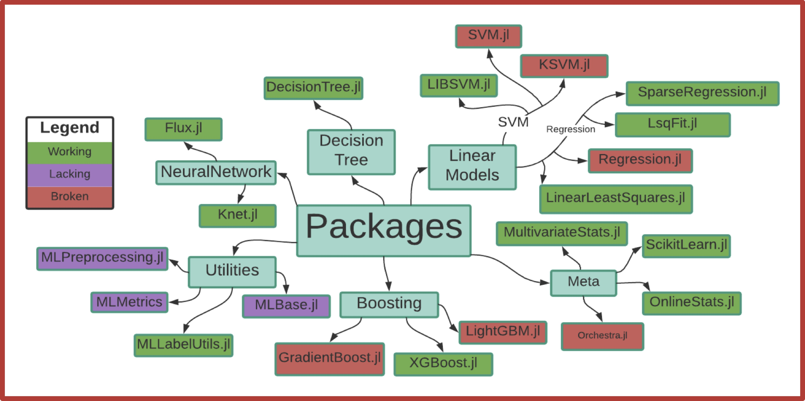

## MLJ

A pure Julia machine learning framework.

[MLJ News](https://github.com/alan-turing-institute/MLJ.jl/blob/master/docs/src/NEWS.md) for  MLJ and its satellite packages, [MLJBase](https://github.com/alan-turing-institute/MLJModels.jl), [MLJModels](https://github.com/alan-turing-institute/MLJModels.jl) and [ScientificTypes](https://github.com/alan-turing-institute/ScientificTypes.jl) | [MLJ Cheatsheet](docs/src/mlj_cheatsheet.md)

## `join!(MLJ, YourModel)`

**Call for help.** MLJ needs your help to ensure its success. This depends
crucially on:

- Existing and developing ML algorithms implementing the MLJ model interface

- Improvements to existing but poorly maintained Julia ML algorithms 

The MLJ model interface is now relatively stable and
[well-documented](https://alan-turing-institute.github.io/MLJ.jl/dev/adding_models_for_general_use/),
and the core team is happy to respond to [issue requests](https://github.com/alan-turing-institute/MLJ.jl/issues) for
assistance. Please click [here](CONTRIBUTE.md) for more details on
contributing.

MLJ is presently supported by a small Alan Turing Institute grant and is looking for new funding sources to grow and maintain the project.

[](https://travis-ci.com/alan-turing-institute/MLJ.jl)
[](https://slackinvite.julialang.org/)
[](https://alan-turing-institute.github.io/MLJ.jl/dev/)
[](https://alan-turing-institute.github.io/MLJ.jl/stable/)
[](https://coveralls.io/github/alan-turing-institute/MLJ.jl?branch=master)



MLJ aims to be a flexible framework for combining and tuning machine
learning models, written in the high performance, rapid development,
scientific programming language, [Julia](https://julialang.org). 

The MLJ project is partly inspired by [MLR](https://mlr.mlr-org.com/index.html).

[List of presently implemented models](https://github.com/alan-turing-institute/MLJModels.jl/tree/master/src/registry/Models.toml)
  

### Installation

At the julia REPL prompt

```julia
using Pkg
Pkg.add("MLJ")
Pkg.add("MLJModels")
```

To obtain a list of all registered models:

```julia
using MLJ
models()
```

To add a package - for example,  DecisionTree - to your load path:

```julia
using Pkg
Pkg.add("DecisionTree")
```

To load all code needed to use a model - for example, DecisionTreeClassifier,

```julia
@load DecisionTreeClassifier
```

which also returns a default instance. Refer to the
[documentation](https://alan-turing-institute.github.io/MLJ.jl/stable/)
for more on instantiating and running loaded models.


**Package conflicts.** If you encounter package conflicts during
installation, and are not familiar with the Julia package manager,
then you can try installation in a fresh environment by first entering
these commmands:


```julia
using Pkg
Pkg.activate("my_mlj_env", shared=true)
```

In future REPL sessions, you can activate your (now populated)
environment with the same command.


A docker image with installation
[instructions](https://github.com/ysimillides/mlj-docker) is also
available.


### Features to include:

- **Automated tuning** of hyperparameters, including
  composite models with *nested parameters*. Tuning implemented as a
  wrapper, allowing composition with other meta-algorithms. &#10004;

- Option to tune hyperparameters using gradient descent and **automatic
	differentiation** (for learning algorithms written in Julia).
	
- Option to tune hyperaparameters using **Bayesian optimisation**

- **Data agnostic**: Train models on any data supported by the Tables.jl 
[interface](https://github.com/JuliaData/Tables.jl). &#10004;

- Intuitive syntax for building arbitrarily complicated
  **learning networks** .&#10004;
  
- Learning networks can be exported as self-contained **composite models** &#10004;, but
  common networks (e.g., linear **pipelines** &#10004;, **stacks**) come ready to plug-and-play.

- Performant parallel implementation of large homogeneous **ensembles**
  of arbitrary models (e.g., random forests). &#10004;

- Model **registry** and facility to **match models** to machine learning
  tasks. &#10004;

- **Benchmarking** a battery of assorted models for a given task.

- Automated estimates of cpu and memory requirements for given task/model.

- Friendly interface for handling **probabilistic** prediction. &#10004;


### Frequently Asked Questions

See [here](docs/src/frequently_asked_questions.md).


### Getting started

Get started
[here](https://alan-turing-institute.github.io/MLJ.jl/stable/),
or take the MLJ [tour](/examples/tour/tour.ipynb).


### History

Antecedents for the current package are
[AnalyticalEngine.jl](https://github.com/tlienart/AnalyticalEngine.jl),
[Orchestra.jl](https://github.com/svs14/Orchestra.jl), and
[Koala.jl](https://github.com/ablaom/Koala.jl). Development was also
guided by a research study group at the University of Warwick,
beginning with a review of existing ML Modules that were available in
Julia at the time
([in-depth](https://github.com/dominusmi/Julia-Machine-Learning-Review/tree/master/Educational),
[overview](https://github.com/dominusmi/Julia-Machine-Learning-Review/tree/master/Package%20Review)).



Further work culminated in the first MLJ
[proof-of-concept](https://github.com/alan-turing-institute/MLJ.jl/tree/poc)

For administrators: [Implementing requests to register new models](REGISTRY.md).
