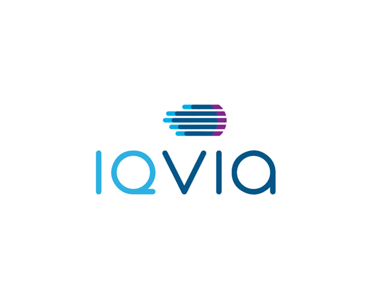

    

<h2 align="center">A Machine Learning Framework for Julia

  
  
  </a>
  <!-- <a href="https://doi.org/10.5281/zenodo.3541506"> -->
  <!-- 
  <!--      alt="Cite MLJ"> -->
  <!-- </a> -->
  
  

</h2>

**New to MLJ? Start [here](https://alan-turing-institute.github.io/MLJ.jl/dev/)**.  

**Wanting to integrate an existing machine learning model into the MLJ
framework? Start
[here](https://alan-turing-institute.github.io/MLJ.jl/dev/quick_start_guide_to_adding_models/)**.

The remaining information on this page will be of interest primarily
to developers interested in contributing to core packages in the MLJ
ecosystem, whose organization is described further below.

MLJ (Machine Learning in Julia) is a toolbox written in Julia
providing a common interface and meta-algorithms for selecting,
tuning, evaluating, composing and comparing over [160 machine
learning
models](https://alan-turing-institute.github.io/MLJ.jl/dev/list_of_supported_models/)
written in Julia and other languages.  

MLJ was initially created as a Tools,
Practices and Systems project at the [Alan Turing
Institute](https://www.turing.ac.uk/) in 2019. Current funding is
provided by a [New Zealand Strategic Science Investment
Fund](https://www.mbie.govt.nz/science-and-technology/science-and-innovation/funding-information-and-opportunities/investment-funds/strategic-science-investment-fund/ssif-funded-programmes/university-of-auckland/).

MLJ is released under the MIT license, and has been developed with the
support of the following organizations:

    
    
    
    
    

 

<a href="#the-mlj-universe">MLJ Universe</a> &nbsp;•&nbsp; 
<a href="#known-issues">Known Issues</a> &nbsp;•&nbsp;
<a href="#customizing-behavior">Customizing Behavior</a> &nbsp;•&nbsp;
<a href="#citing-mlj">Citing MLJ</a> 

 

### The MLJ Universe

The functionality of MLJ is distributed over a number of repositories
illustrated in the dependency chart below. These repositories live at the [JuliaAI umbrella](https://github.com/JuliaAI).

    

*Dependency chart for MLJ repositories. Repositories with dashed
connections do not currently exist but are planned/proposed.*

 

<a href="CONTRIBUTING.md">Contributing</a> &nbsp;•&nbsp; 
<a href="ORGANIZATION.md">Code Organization</a> &nbsp;•&nbsp;
<a href="ROADMAP.md">Road Map</a> 
 

#### Contributors

*Core design*: A. Blaom, F. Kiraly, S. Vollmer

*Active maintainers*: A. Blaom, T. Lienart, S. Okon

*Active collaborators*: D. Arenas, D. Buchaca, J. Hoffimann, S. Okon, J. Samaroo, S. Vollmer

*Past collaborators*: D. Aluthge, E. Barp, G. Bohner, M. K. Borregaard, V. Churavy, H. Devereux, M. Giordano, M. Innes, F. Kiraly, M. Nook, Z. Nugent, P. Oleśkiewicz, A. Shridar, Y. Simillides, A. Sengupta, A. Stechemesser.

#### License

MLJ is supported by the Alan Turing Institute and released under the MIT "Expat" License.
´
