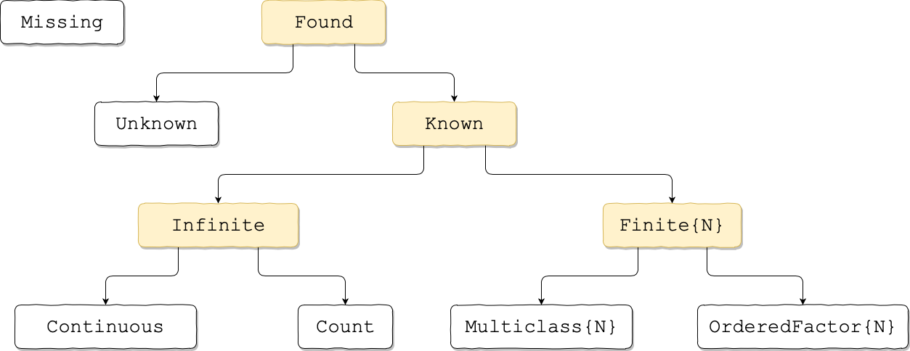

# Adding New Models

This guide outlines in detail the specification of the MLJ model interface and
provides guidelines for implementing the interface for models intended
for general use. For sample implementations, see
[MLJModels/src](https://github.com/alan-turing-institute/MLJModels.jl/tree/master/src).

The machine learning tools provided by MLJ can be applied to the
models in any package that imports the package
[MLJBase](https://github.com/alan-turing-institute/MLJBase.jl) and
implements the API defined there, as outlined below. For a
quick-and-dirty implementation of user-defined models see [Simple User
Defined Models](simple_user_defined_models.md).  To make new models
available to all MLJ users, see [Where to place code implementing new
models](@ref).

It is assumed the reader has read [Getting Started](index.md).
To implement the API described here, some familiarity with the
following packages is also helpful:

- [Distributions.jl](https://github.com/JuliaStats/Distributions.jl)
  (for probabilistic predictions)

- [CategoricalArrays.jl](https://github.com/JuliaData/CategoricalArrays.jl)
  (essential if you are implementing a model handling data of
  `Multiclass` or `OrderedFactor` scitype)

- [Tables.jl](https://github.com/JuliaData/Tables.jl) (if you're
  algorithm needs input data in a novel format).

In MLJ, the basic interface exposed to the user, built atop the model
interface described here, is the *machine interface*. After a first
reading of this document, the reader may wish to refer to [MLJ
Internals](internals.md) for context.


### Overview

A *model* is an object storing hyperparameters associated with some
machine learning algorithm.  In MLJ, hyperparameters include configuration
parameters, like the number of threads, and special instructions, such
as "compute feature rankings", which may or may not affect the final
learning outcome.  However, the logging level (`verbosity` below) is
excluded.

The name of the Julia type associated with a model indicates the
associated algorithm (e.g., `DecisionTreeClassifier`). The outcome of
training a learning algorithm is called a *fitresult*. For
ordinary multilinear regression, for example, this would be the
coefficients and intercept. For a general supervised model, it is the
(generally minimal) information needed to make new predictions.

The ultimate supertype of all models is `MLJBase.Model`, which
has two abstract subtypes:

```julia
abstract type Supervised <: Model end
abstract type Unsupervised <: Model end
```

`Supervised` models are further divided according to whether they are
able to furnish probabilistic predictions of the target (which they
will then do so by default) or directly predict "point" estimates, for each
new input pattern:

```julia
abstract type Probabilistic <: Supervised end
abstract type Deterministic <: Supervised end
```

Further division of model types is realized through [Trait declarations](@ref).

Associated with every concrete subtype of `Model` there must be a
`fit` method, which implements the associated algorithm to produce the
fitresult. Additionally, every `Supervised` model has a `predict`
method, while `Unsupervised` models must have a `transform`
method. More generally, methods such as these, that are dispatched on
a model instance and a fitresult (plus other data), are called
*operations*. `Probabilistic` supervised models optionally implement a
`predict_mode` operation (in the case of classifiers) or a
`predict_mean` and/or `predict_median` operations (in the case of
regressors) although MLJBase also provides fallbacks that will suffice
in most cases. `Unsupervised` models may implement an
`inverse_transform` operation.


### New model type declarations and optional clean! method

Here is an example of a concrete supervised model type declaration:

```julia
import MLJ

mutable struct RidgeRegressor <: MLJBase.Deterministic
    lambda::Float64
end
```

Models (which are mutable) should not be given internal
constructors. It is recommended that they be given an external lazy
keyword constructor of the same name. This constructor defines default values for
every field, and optionally corrects invalid field values by calling a `clean!` method
(whose fallback returns an empty message string):

```julia
function MLJ.clean!(model::RidgeRegressor)
    warning = ""
    if model.lambda < 0
        warning *= "Need lambda ≥ 0. Resetting lambda=0. "
        model.lambda = 0
    end
    return warning
end

# keyword constructor
function RidgeRegressor(; lambda=0.0)
    model = RidgeRegressor(lambda)
    message = MLJBase.clean!(model)
    isempty(message) || @warn message
    return model
end
```


### Supervised models

The compulsory and optional methods to be implemented for each
concrete type `SomeSupervisedModel <: MLJBase.Supervised` are
summarized below. An `=` indicates the return value for a fallback
version of the method.


#### Summary of methods

Compulsory:

```julia
MLJBase.fit(model::SomeSupervisedModel, verbosity::Integer, X, y) -> fitresult, cache, report
MLJBase.predict(model::SomeSupervisedModel, fitresult, Xnew) -> yhat
```

Fallback to be overridden if model input is univariate:

```julia
MLJBase.input_is_multivariate(::Type{<:SomeSupervisedModel}) = true
```

Optional, to check and correct invalid hyperparameter values:

```julia
MLJBase.clean!(model::SomeSupervisedModel) = "" 
```

Optional, to return user-friendly form of fitted parameters:

```julia
MLJBase.fitted_params(model::SomeSupervisedModel, fitresult) = fitresult
```

Optional, to avoid redundant calculations when re-fitting machines:

```julia
MLJBase.update(model::SomeSupervisedModel, verbosity, old_fitresult, old_cache, X, y) =
   MLJBase.fit(model, verbosity, X, y)
```

Optional, if `SomeSupervisedModel <: Probabilistic`:

```julia
MLJBase.predict_mode(model::SomeSupervisedModel, fitresult, Xnew) =
    mode.(predict(model, fitresult, Xnew))
MLJBase.predict_mean(model::SomeSupervisedModel, fitresult, Xnew) =
    mean.(predict(model, fitresult, Xnew))
MLJBase.predict_median(model::SomeSupervisedModel, fitresult, Xnew) =
    median.(predict(model, fitresult, Xnew))
```

Required, if model is to be registered (findable by general users):

```julia
MLJBase.load_path(::Type{<:SomeSupervisedModel})    = ""
MLJBase.package_name(::Type{<:SomeSupervisedModel}) = "Unknown"
MLJBase.package_uuid(::Type{<:SomeSupervisedModel}) = "Unknown"
```

Recommended, to constrain the form of input data passed to fit and predict:

```julia
MLJBase.input_scitype_union(::Type{<:SomeSupervisedModel}) = Union{Missing,Found}
```

Recommended, to constrain the form of target data passed to fit (and
compulsory if target is multivariate/sequential):

```julia
MLJBase.target_scitype_union(::Type{<:SomeSupervisedModel}) = Union{Found,NTuple{<:Found}}
```

Optional but recommended:

```julia
MLJBase.package_url(::Type{<:SomeSupervisedModel})  = "Unknown"
MLJBase.is_pure_julia(::Type{<:SomeSupervisedModel}) = false
```


#### The form of data for fitting and predicting

The inputs `X` and `Xnew` for `fit` and `predict` are
always tables, unless one defines

```julia
MLJBase.input_is_multivariate(::Type{<:SomeSupervisedModel}) = false
```

The target `y` is always an `AbstractVector` (see the discussion in
[Getting Started](@ref)). For multivariate or sequence-valued
targets, a `target_scitype_union` declaration is required. This is
discussed under [Trait declarations](@ref) below, which also describes how
to constrain the element types of data.

##### Additional type coercions

If the core algorithm being wrapped requires data in a different or
more specific form, then `fit` will need to coerce the table into the
form desired (and the same coercions applied to `X` will have to be
repeated for `Xnew` in `predict`). To assist with common cases, MLJ
provides the convenience method
`MLJBase.matrix`. `MLJBase.matrix(Xtable)` has type `Matrix{T}` where
`T` is the tightest common type of elements of `Xtable`, and `Xtable`
is any table.

Other auxiliary methods provided by MLJBase for handling tabular data
are: `selectrows`, `selectcols`, `select` and `schema` (for extracting
the size, names and eltypes of a table). See [Convenience
methods](@ref) below for details.

##### Important convention

It is to be understood that the columns of the
table `X` correspond to features and the rows to patterns.


#### The fit method

A compulsory `fit` method returns three objects:

```julia
MLJBase.fit(model::SomeSupervisedModel, verbosity::Int, X, y) -> fitresult, cache, report
```

Note: The `Int` typing of `verbosity` cannot be omitted.

1. `fitresult` is the fitresult in the sense above (which becomes an
    argument for `predict` discussed below).

2.  `report` is a (possibly empty) `NamedTuple`, for example,
    `report=(deviance=..., dof_residual=..., stderror=..., vcov=...)`.
    Any training-related statistics, such as internal estimates of the
    generalization error, and feature rankings, should be returned in
    the `report` tuple. How, or if, these are generated should be
    controlled by hyperparameters (the fields of `model`). Fitted
    parameters, such as the coefficients of a linear model, do not go
    in the report as they will be extractable from `fitresult` (and
    accessible to MLJ through the `fitted_params` method described below).

3.	The value of `cache` can be `nothing`, unless one is also defining
      an `update` method (see below). The Julia type of `cache` is not
      presently restricted.

It is not necessary for `fit` to provide dimension checks or to call
`clean!` on the model; MLJ will carry out such checks.

The method `fit` should never alter hyperparameter values. If the
package is able to suggest better hyperparameters, as a byproduct of
training, return these in the report field.

The `verbosity` level (0 for silent) is for passing to learning
algorithm itself. A `fit` method wrapping such an algorithm should
generally avoid doing any of its own logging.


#### The fitted_params method

A `fitted_params` method may be optionally overloaded. It's purpose is
to provide MLJ access to a user-friendly representation of the
learned parameters of the model (as opposed to the
hyperparameters). They must be extractable from `fitresult`.

```julia
MLJBase.fitted_params(model::SomeSupervisedModel, fitresult) -> friendly_fitresult::NamedTuple
```

For a linear model, for example, one might declare something like
`friendly_fitresult=(coefs=[...], bias=...)`.

The fallback is to return `(fitresult=fitresult,)`.


#### The predict method

A compulsory `predict` method has the form
```julia
MLJBase.predict(model::SomeSupervisedModel, fitresult, Xnew) -> yhat
```

Here `Xnew` will be have the same form as the `X` passed to `fit`.

##### Prediction types for deterministic responses.

In the case of `Deterministic` models, `yhat` should be an
`AbstractVector` (commonly a plain `Vector`) with the same element
type as the target `y` passed to the `fit` method (see above). Any
`CategoricalValue` or `CategoricalString` appearing in `yhat` **must
have the same levels in its pool as was present in the elements of
the target `y` presented in training**, even if not all levels appear
in the training data or prediction itself. For example, in the
univariate target case, this means `MLJ.classes(yhat[i]) =
MLJ.classes(y[j])` for all admissible `i` and `j`. (The method
`classes` is described under [Convenience methods](@ref) below).

Unfortunately, code not written with the preservation of categorical
levels in mind poses special problems. To help with this, MLJBase
provides three utility methods: `int` (for converting a
`CategoricalValue` or `CategoricalString` into an integer, the
ordering of these integers being consistent with that of the pool),
`decoder` (for constructing a callable object that decodes the
integers back into `CategoricalValue`/`CategoricalString` objects),
and `classes`, for extracting the complete pool from a single
value. Refer to [Convenience methods](@ref) below for important
details.

Note that a decoder created during `fit` may need to be bundled with
`fitresult` to make it available to `predict` during re-encoding. So,
for example, if the core algorithm being wrapped by `fit` expects a
nominal target `yint` of type `Vector{<:Integer}` then a `fit` method
may look something like this:

```julia
function MLJBase.fit(model::SomeSupervisedModel, verbosity, X, y)
    yint = MLJBase.int(y) 
    a_target_element = y[1]                    # a CategoricalValue/String
    decode = MLJBase.decoder(a_target_element) # can be called on integers
	
    core_fitresult = SomePackage.fit(X, yint, verbosity=verbosity)

    fitresult = (decode, core_fitresult)
    cache = nothing
    report = nothing
    return fitresult, cache, report
end
```

while a corresponding deterministic `predict` operation might look like this:

```julia
function MLJBase.predict(model::SomeSupervisedModel, fitresult, Xnew)
    decode, core_fitresult = fitresult
    yhat = SomePackage.predict(core_fitresult, Xnew)
    return decode.(yhat)  # or decode(yhat) also works
end
```

For a concrete example, refer to the
[code](https://github.com/alan-turing-institute/MLJModels.jl/blob/master/src/ScikitLearn.jl)
for `SVMClassifier`.

Of course, if you are coding a learning algorithm from scratch, rather
than wrapping an existing one, these extra measures may be unnecessary.

##### Prediction types for probabilistic responses

In the case of `Probabilistic` models with univariate targets, `yhat`
must be a `Vector` whose elements are distributions (one distribution
per row of `Xnew`).

Presently, a *distribution* is any object `d` for which
`MLJBase.isdistribution(::d) = true`, which includes all objects of
type `Distributions.Distribution` from the package
Distributions.jl. (Soon any `Distributions.Sampleable` will be
included.) The declaration `MLJBase.isdistribution(::d) = true`
implies that at least `Base.rand(d)` is implemented, but the rest of
this API is still a work-in-progress.

Use the distribution `MLJBase.UnivariateFinite` for `Probabilistic`
models predicting a target with `Finite` scitype (classifiers). In
this case each element of the training target `y` is a
`CategoricalValue` or `CategoricalString`, as in this contrived example:

```julia
using CategoricalArrays
y = identity.(categorical([:yes, :no, :no, :maybe, :maybe]))
```

Note that, as in this case, we cannot assume `y` is a
`CategoricalVector`, and we rely on elements for pool information (if
we need it); this is accessible using the convenience method
`MLJ.classes`:

```julia
julia> yes = y[1]
julia> levels = MLJBase.classes(yes)
3-element Array{CategoricalValue{Symbol,UInt32},1}:
 :maybe
 :no
 :yes
```

Now supposing that, for some new input pattern, the elements `yes =
y[1]` and `no = y[2]` are to be assigned respective probabilities of
0.2 and 0.8. Then the corresponding distribution `d` is constructed as
follows:

```julia
julia> d = MLJBase.UnivariateFinite([yes, no], [0.2, 0.8])
UnivariateFinite{CategoricalValue{Symbol,UInt32},Float64}(Dict(:yes=>0.2,:maybe=>0.0,:no=>0.8))

julia> pdf(d, yes)
0.2

julia> maybe = y[4]; pdf(d, maybe)
0.0
```

Alternatively, a dictionary can be passed to the constructor. 

```@docs
MLJBase.UnivariateFinite
```


#### Trait declarations

Two trait functions allow the implementer to restrict the types of
elements appearing in the inputs `X`, and `Xnew` passed to `fit` and
`predict`, and the elements appearing in the training target `y`. The
MLJ task interface also uses these traits to match models to tasks. So
if they are omitted (and your model is registered) then a general user
may attempt to use your model with inappropriately typed data.

The trait functions `input_scitype_union` and `target_scitype_union`
take scientific data types as values (see [Getting Started](@ref) for
scitype basics). These types are organized in the following hierarchy:



For example,  to ensure that elements of `X` presented to the `DecisionTreeClassifier` `fit` method all have `Continuous`
scitype (and hence `AbstractFloat` machine type), one declares

```julia
MLJBase.input_scitype_union(::Type{<:DecisionTreeClassifier}) = MLJBase.Continuous
```

For, in general, MLJ will never call `fit(model::SomeSuperivsedModel,
verbosity, X, y)` unless `Union{scitypes(X)...} <:
inputs_scitype_union(SomeSupervisedModel)` holds. (See [Convenience
methods](@ref) below for more on the `scitypes` and related
`scitype_union` methods.)

Similarly, one declares

```julia
MLJBase.target_scitype_union(::Type{<:DecisionTreeClassifier}) = MLJBase.Finite
```

to ensure that all elements of the target `y` (which is always an
`AbstractVector`) have `Finite` scitype (and hence `CategoricalValue`
or `CategoricalString` machine type). This is because, in the general
case, MLJ guarantees that `scitype_union(y) <:
target_scitype_union(SomeSupervisedModel)`.

##### Multivariate targets

The above remarks continue to hold unchanged for the case multivariate
targets.  In this case the elements of the `AbstractVector` `y` are
now tuples. If, for example, you declare

```julia
target_scitype_union(SomeSupervisedModel) = Tuple{Continuous,Count}
```

then each element of `y` will be a tuple of type
`Tuple{AbstractFloat,Integer}`. For predicting variable length
sequences of, say, binary values, use

```julia
target_scitype_union(SomeSupervisedModel) = NTuple{<:Multiclass{2}}
```

The trait functions controlling the form of data are summarized as follows:

method                   | return type       | declarable return values                  | default value
-------------------------|-------------------|-------------------------------------------|---------------
`input_is_multivariate`  | `Bool`            | `true` or `false`                         | `true`
`input_scitype_union`    | `DataType`        | subtype of `Union{Missing,Found}`         | `Union{Missing,Found}`
`target_scitype_union`   | `DataType`        | subtype of `Found` or tuple of such types | `Union{Found,NTuple{<:Found}}`


Additional trait functions tell MLJ's `@load` macro how to find your
model if it is registered, and provide other self-explanatory metadata
about the model:

method                   | return type       | declarable return values           | default value
-------------------------|-------------------|------------------------------------|---------------
`load_path`              | `String`          | unrestricted                       | "unknown"
`package_name`           | `String`          | unrestricted                       | "unknown"
`package_uuid`           | `String`          | unrestricted                       | "unknown"
`package_url`            | `String`          | unrestricted                       | "unknown"
`is_pure_julia`          | `Bool`            | `true` or `false`                  | `false`

Here is the complete list of trait function declarations for `DecistionTreeClassifier` 
([source](https://github.com/alan-turing-institute/MLJModels.jl/blob/master/src/DecisionTree.jl)):

```julia
MLJBase.input_is_multivariate(::Type{<:DecisionTreeClassifier}) = true
MLJBase.input_scitype_union(::Type{<:DecisionTreeClassifier}) = MLJBase.Continuous
MLJBase.target_scitype_union(::Type{<:DecisionTreeClassifier}) = MLJBase.Finite
MLJBase.load_path(::Type{<:DecisionTreeClassifier}) = "MLJModels.DecisionTree_.DecisionTreeClassifier" 
MLJBase.package_name(::Type{<:DecisionTreeClassifier}) = "DecisionTree"
MLJBase.package_uuid(::Type{<:DecisionTreeClassifier}) = "7806a523-6efd-50cb-b5f6-3fa6f1930dbb"
MLJBase.package_url(::Type{<:DecisionTreeClassifier}) = "https://github.com/bensadeghi/DecisionTree.jl"
MLJBase.is_pure_julia(::Type{<:DecisionTreeClassifier}) = true
```

You can test all your declarations of traits by calling `info(SomeModel)`.


#### Iterative models and the update! method

An `update` method may be optionally overloaded to enable a call by
MLJ to retrain a model (on the same training data) to avoid repeating
computations unnecessarily.

```julia
MLJBase.update(model::SomeSupervisedModel, verbosity, old_fitresult, old_cache, X, y) -> fitresult, cache, report
```

If an MLJ `Machine` is being `fit!` and it is not the first time, then
`update` is called instead of `fit`, unless the machine `fit!` has
been called with a new `rows` keyword argument. However, `MLJBase`
defines a fallback for `update` which just calls `fit`. For context,
see [MLJ Internals](internals.md).

Learning networks wrapped as models constitute one use-case (see
[Learning Networks](@ref)): One would like each component model to be
retrained only when hyperparameter changes "upstream" make this
necessary. In this case MLJ provides a fallback (specifically, the
fallback is for any subtype of `SupervisedNetwork =
Union{DeterministicNetwork,ProbabilisticNetwork}`). A second more
generally relevant use-case is iterative models, where calls to
increase the number of iterations only restarts the iterative
procedure if other hyperparameters have also changed. For an example,
see the MLJ [ensemble
code](https://github.com/alan-turing-institute/MLJ.jl/blob/master/src/ensembles.jl).

In the event that the argument `fitresult` (returned by a preceding
call to `fit`) is not sufficient for performing an update, the author
can arrange for `fit` to output in its `cache` return value any
additional information required, as this is also passed as an argument
to the `update` method.


### Unsupervised models

TODO

- `transform` should return a table unless `output_is_multivariate` is
set `false`. Convenience method: `table` (for materializing an
`AbstractMatrix`, or named tuple of vectors, as a table matching a
given prototype)

- instead of `target_scitype_union` have `output_scitype_union`

-  `input_is_multivariate` and `input_scitype_union` are the same 


### Convenience methods

```@docs
MLJBase.int
```

```@docs
MLJBase.classes
```

```@docs
MLJBase.decoder
```

```@docs
MLJBase.matrix
```

```@docs
MLJBase.table
```

```@docs
MLJBase.select
```

```@docs
MLJBase.selectrows
```

```@docs
MLJBase.selectcols
```

```@docs
MLJBase.schema
```

```@docs
MLJBase.nrows
```

```@docs
MLJBase.scitype
```

```@docs
MLJBase.scitype_union
```

```@docs
MLJBase.scitypes
```

### Where to place code implementing new models

Note that different packages can implement models having the same name
without causing conflicts, although an MLJ user cannot simultaneously
*load* two such models.

There are two options for making a new model implementation available
to all MLJ users:

1. **Native implementations** (preferred option). The implementation
   code lives in the same package that contains the learning
   algorithms implementing the interface. In this case, it is
   sufficient to open an issue at
   [MLJRegistry](https://github.com/alan-turing-institute/MLJRegistry.jl)
   requesting the package to be registered with MLJ. Registering a package allows
   the MLJ user to access its models' metadata and to selectively load them.

2. **External implementations** (short-term alternative). The model
   implementation code is necessarily separate from the package
   `SomePkg` defining the learning algorithm being wrapped. In this
   case, the recommended procedure is to include the implementation
   code at
   [MLJModels/src](https://github.com/alan-turing-institute/MLJModels.jl/tree/master/src)
   via a pull-request, and test code at
   [MLJModels/test](https://github.com/alan-turing-institute/MLJModels.jl/tree/master/test).
   Assuming `SomePkg` is the only package imported by the
   implementation code, one needs to: (i) register `SomePkg` at
   MLJRegistry as explained above; and (ii) add a corresponding
   `@require` line in the PR to
   [MLJModels/src/MLJModels.jl](https://github.com/alan-turing-institute/MLJModels.jl/tree/master/src/MLJModels.jl)
   to enable lazy-loading of that package by MLJ (following the
   pattern of existing additions). If other packages must be imported,
   add them to the MLJModels project file after checking they are not
   already there. If it is really necessary, packages can be also
   added to Project.toml for testing purposes.
   
Additionally, one needs to ensure that the implementation code defines
the `package_name` and `load_path` model traits appropriately, so that
`MLJ`'s `@load` macro can find the necessary code (see
[MLJModels/src](https://github.com/alan-turing-institute/MLJModels.jl/tree/master/src)
for examples). The `@load` command can only be tested after
registration. If changes are made, lodge an issue at
[MLJRegistry](https://github.com/alan-turing-institute/MLJRegistry.jl)
to make the changes available to MLJ.  

