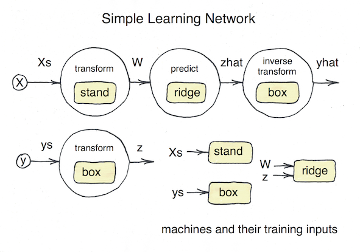

# Composing Models

MLJ has a flexible interface for composing multiple machine learning
elements to form a *learning network*, whose complexity can extend
beyond the "pipelines" of other machine learning toolboxes. However,
MLJ does provide special syntax for common use cases, which are
described first below. A description of the general framework begins
at [Learning Networks](@ref).


## Linear pipelines

In MLJ a *pipeline* is a composite model in which models are chained
together in a linear (non-branching) chain. Pipelines can include
learned or static target transformations, if one of the models is
supervised.

To illustrate basic construction of a pipeline, consider the following
toy data:

```@setup 7
import Base.eval
using MLJ
MLJ.color_off()
```

```@example 7
using MLJ
X = (age    = [23, 45, 34, 25, 67],
     gender = categorical(['m', 'm', 'f', 'm', 'f']));
height = [67.0, 81.5, 55.6, 90.0, 61.1];
```

The code below creates a new pipeline model type called `MyPipe` for
performing the following operations:

- standardize the target variable `:height` to have mean zero and
  standard deviation one
- coerce the `:age` field to have `Continuous` scitype
- one-hot encode the categorical feature `:gender`
- train a K-nearest neighbor model on the transformed inputs and
  transformed target
- restore the predictions of the KNN model to the original `:height`
  scale (i.e., invert the standardization)

The code also creates an instance of the new pipeline model type,
called `pipe`, whose hyperparameters `hot`, `knn`, and `stand` are the
component model instances specified in the macro expression:

```julia
julia> pipe = @pipeline MyPipe(X -> coerce(X, :age=>Continuous),
                               hot = OneHotEncoder(),
                               knn = KNNRegressor(K=3),
                               target = UnivariateStandardizer())

MyPipe(hot = OneHotEncoder(features = Symbol[],
                           drop_last = false,
                           ordered_factor = true,),
       knn = KNNRegressor(K = 3,
                          metric = MLJModels.KNN.euclidean,
                          kernel = MLJModels.KNN.reciprocal,),
       target = UnivariateStandardizer(),) @ 1…39
```

We can, for example, evaluate the pipeline like we would any other model:

```julia
julia> pipe.knn.K = 2
julia> pipe.hot.drop_last = true
julia> evaluate(pipe, X, height, resampling=Holdout(), measure=rms, verbosity=2)

[ Info: Training Machine{MyPipe} @ 4…44.
[ Info: Training NodalMachine{OneHotEncoder} @ 1…16.
[ Info: Spawning 1 sub-features to one-hot encode feature :gender.
[ Info: Training NodalMachine{UnivariateStandardizer} @ 5…65.
[ Info: Training NodalMachine{KNNRegressor} @ 1…49.
(measure = MLJBase.RMS[rms],
 measurement = [10.0336],
 per_fold = Array{Float64,1}[[10.0336]],
 per_observation = Missing[missing],)
```

For important details on including target transformations, see below.

```@docs
@pipeline
```


## Homogeneous Ensembles

For performance reasons, creating a large ensemble of models sharing a
common set of hyperparameters is achieved in MLJ through a model
wrapper, rather than through the learning networks API. See the
separate [Homogeneous Ensembles](homogeneous_ensembles.md) section for
details.


## Learning Networks

Hand-crafting a learning network, as outlined below, is a relatively
advanced MLJ feature, assuming familiarity with the basics outlined in
[Getting Started](index.md). The syntax for building a learning
network is essentially an extension of the basic syntax but with data
containers replaced with nodes ("dynamic data").

In MLJ, a *learning network* is a directed acyclic graph whose nodes
apply an operation, such as `predict` or `transform`, using a fixed
machine (requiring training) - or which, alternatively, applies a
regular (untrained) mathematical operation, such as `+`, `log` or
`vcat`, to its input(s). In practice, a learning network works with
fixed sources for its training/evaluation data, but can be built and
tested in stages. By contrast, an *exported learning network* is a
learning network exported as a stand-alone, re-usable `Model` object,
to which all the MLJ `Model` meta-algorithms can be applied
(ensembling, systematic tuning, etc).

As we shall see, exporting a learning network as a reusable model, is
quite simple. While one can entirely skip the build-and-train steps,
experimenting with raw learning networks may be the best way to
understand how the stand-alone models work under the hood.

In MLJ learning networks treat the flow of information during training
and predicting separately. Also, different nodes may use the same
paramaters (fitresult) learned during the training of some model (that
is, point to a common *nodal machine*; see below). For these reasons,
simple examples may appear more slightly more complicated than in
other frameworks. However, in more sophisticated applications, the
extra flexibility is essential.


### Building a simple learning network



The diagram above depicts a learning network which standardizes the
input data `X`, learns an optimal Box-Cox transformation for the
target `y`, predicts new target values using ridge regression, and
then inverse-transforms those predictions, for later comparison with
the original test data. The machines are labeled in yellow.

For testing purposes, we'll use a small synthetic data set:

```julia
using Statistics, DataFrames

@load RidgeRegressor pkg=MultivariateStats

x1 = rand(300)
x2 = rand(300)
x3 = rand(300)
y = exp.(x1 - x2 -2x3 + 0.1*rand(300))
X = DataFrame(x1=x1, x2=x2, x3=x3)

Xs = source(X)
ys = source(y, kind=:target)
```

```julia
Source @ 3…40
```

*Note.* Once can wrap the source nodes around `nothing` instead of
actual data. One can still export the resulting network as a
stand-alone model (see later) but will be unable to fit or call on
network nodes as described below.

We label nodes we will construct according to their outputs in the
diagram. Notice that the nodes `z` and `yhat` use the same machine,
namely `box`, for different operations.

To construct the `W` node we first need to define the machine `stand`
that it will use to transform inputs.

```julia
stand_model = Standardizer()
stand = machine(stand_model, Xs)
```

```julia
NodalMachine @ 6…82 = machine(Standardizer{} @ 1…82, 3…40)
```

Because `Xs` is a node, instead of concrete data, we can call
`transform` on the machine without first training it, and the result
is the new node `W`, instead of concrete transformed data:

```julia
W = transform(stand, Xs)
```

```julia
Node @ 1…67 = transform(6…82, 3…40)
```

To get actual transformed data we *call* the node appropriately, which
will require we first train the node. Training a node, rather than a
machine, triggers training of *all* necessary machines in the network.


```julia
test, train = partition(eachindex(y), 0.8)
fit!(W, rows=train)
W()           # transform all data
W(rows=test ) # transform only test data
W(X[3:4,:])   # transform any data, new or old
```

```julia
2×3 DataFrame
│ Row │ x1        │ x2       │ x3        │
│     │ Float64   │ Float64  │ Float64   │
├─────┼───────────┼──────────┼───────────┤
│ 1   │ -0.516373 │ 0.675257 │ 1.27734   │
│ 2   │ 0.63249   │ -1.70306 │ 0.0479891 │
```

If you like, you can think of `W` (and the other nodes we will define)
as "dynamic data": `W` is *data*, in the sense that it an be called
("indexed") on rows, but *dynamic*, in the sense the result depends on
the outcome of training events.

The other nodes of our network are defined similarly:

```julia
box_model = UnivariateBoxCoxTransformer()  # for making data look normally-distributed
box = machine(box_model, ys)
z = transform(box, ys)

ridge_model = RidgeRegressor(lambda=0.1)
ridge =machine(ridge_model, W, z)
zhat = predict(ridge, W)

yhat = inverse_transform(box, zhat)
```

```julia
Node @ 1…07 = inverse_transform(1…09, predict(2…66, transform(6…82, 3…40)))
```

We are ready to train and evaluate the completed network. Notice that
the standardizer, `stand`, is *not* retrained, as MLJ remembers that
it was trained earlier:


```julia
fit!(yhat, rows=train)
```

```julia
[ Info: Not retraining NodalMachine{Standardizer} @ 6…82. It is up-to-date.
[ Info: Training NodalMachine{UnivariateBoxCoxTransformer} @ 1…09.
[ Info: Training NodalMachine{RidgeRegressor} @ 2…66.
Node @ 1…07 = inverse_transform(1…09, predict(2…66, transform(6…82, 3…40)))
```

```julia
rms(y[test], yhat(rows=test)) # evaluate
```

```julia
0.022837595088079567
```

We can change a hyperparameters and retrain:

```julia
ridge_model.lambda = 0.01
fit!(yhat, rows=train)
```

```julia
[ Info: Not retraining NodalMachine{UnivariateBoxCoxTransformer} @ 1…09. It is up-to-date.
[ Info: Not retraining NodalMachine{Standardizer} @ 6…82. It is up-to-date.
[ Info: Updating NodalMachine{RidgeRegressor} @ 2…66.
Node @ 1…07 = inverse_transform(1…09, predict(2…66, transform(6…82, 3…40)))
```

And re-evaluate:

```julia
rms(y[test], yhat(rows=test))
0.039410306910269116
```

> **Notable feature.** The machine, `ridge::NodalMachine{RidgeRegressor}`, is retrained, because its underlying model has been mutated. However, since the outcome of this training has no effect on the training inputs of the machines `stand` and `box`, these transformers are left untouched. (During construction, each node and machine in a learning network determines and records all machines on which it depends.) This behavior, which extends to exported learning networks, means we can tune our wrapped regressor (using a holdout set) without re-computing transformations each time the hyperparameter is changed.


## Exporting a learning network as a stand-alone model

Having satisfied that our learning network works on the synthetic
data, we are ready to export it as a stand-alone model.


### Method I: The @from_network  macro

The following call simultaneously defines a new model subtype
`WrappedRidgeI <: Supervised` and creates an instance of this type
`wrapped_modelI`:

```julia
wrapped_ridgeI = @from_network WrappedRidgeI(ridge=ridge_model) <= yhat
```

Any MLJ work-flow can be applied to this composite model:

```julia
julia> params(wrapped_ridgeI)
```

```julia
(ridge = (lambda = 0.01,),)
```

```julia
X, y = @load_boston
evaluate(wrapped_ridgeI, X, y, resampling=CV(), measure=rms, verbosity=0)
```

*Notes:*

- A deep copy of the original learning network `ridge_model` has
  become the default value for the field `ridge` of the new
  `WrappedRidgeI` struct.

- It is important to have labeled the target source, as in `ys = source(y,
  kind=:target)`, to ensure the network is exported as a *supervised*
  model.

- One can can also use the `@from_network` to export unsupervised
  learning networks and the syntax is the same. For example:

```julia
langs_composite = @from_network LangsComposite(pca=network_pca) <= Xout
```

- For a supervised network making *probabilistic* predictions, one must add
`is_probabilistic=true` to the end of the `@from network` call. For example:

```julia
petes_composite = @from_network PetesComposite(tree_classifier=network_tree) probabilistic=true
```

### Method II: Finer control

In Method I above, only models appearing in the network will
appear as hyperparameters of the exported composite model. There is a
second more flexible method for exporting the network, which allows
finer control over the exported `Model` struct (see the example under
[Static operations on nodes](@ref) below) and which also avoids
macros. The two steps required are:

- Define a new `mutable struct` model type.

- Wrap the learning network code in a model `fit` method.

All learning networks that make deterministic (respectively,
probabilistic) predictions export to models of subtype
`DeterministicNetwork` (respectively, `ProbabilisticNetwork`),
Unsupervised learning networks export to `UnsupervisedNetwork` model
subtypes.

```julia
mutable struct WrappedRidgeII <: DeterministicNetwork
    ridge_model
end

# keyword constructor
WrappedRidgeII(; ridge=RidgeRegressor()) = WrappedRidgeII(ridge); 
```

We now simply cut and paste the code defining the learning network
into a model `fit` method (as opposed to machine `fit!` methods, which
internally dispatch model `fit` methods on the data bound to the
machine):


```julia
function MLJ.fit(model::WrappedRidgeII, verbosity::Integer, X, y)
    Xs = source(X)
    ys = source(y, kind=:target)

    stand_model = Standardizer()
    stand = machine(stand_model, Xs)
    W = transform(stand, Xs)

    box_model = UnivariateBoxCoxTransformer()  # for making data look normally-distributed
    box = machine(box_model, ys)
    z = transform(box, ys)

    ridge_model = model.ridge_model ###
    ridge =machine(ridge_model, W, z)
    zhat = predict(ridge, W)

    yhat = inverse_transform(box, zhat)
    fit!(yhat, verbosity=0)

    return fitresults(yhat)
end
```

The line marked `###`, where the new exported model's hyperparameter
`ridge` is spliced into the network, is the only modification. This
completes the export process.

> **What's going on here?** MLJ's machine interface is built atop a more primitive *[model](simple_user_defined_models.md)* interface, implemented for each algorithm. Each supervised model type (eg, `RidgeRegressor`) requires model `fit` and `predict` methods, which are called by the corresponding *machine* `fit!` and `predict` methods. We don't need to define a  model `predict` method here because MLJ provides a fallback which simply calls the terminating node of the network built in `fit` on the data supplied. The expression `fitresults(yhat)` bundles the terminal node `yhat` with reports (one for each machine in the network) and moves training data out to a bundled cache object. This ensures machines wrapping exported model instances do not contain actual training data in their `fitresult` fields.  


```julia
using CSV
X, y = load_boston()()
evaluate(wrapped_ridgeI, X, y, resampling=CV(), measure=rms, verbosity=0)
```

```julia
6-element Array{Float64,1}:
 3.0225867093289347
 4.755707358891049
 5.011312664189936
 4.226827668908119
 8.93385968738185  
 3.4788524973220545
```

Another example of an exported learning network is given in the next
subsection.


## Static operations on nodes

Continuing to view nodes as "dynamic data", we can, in addition to
applying "dynamic" operations like `predict` and `transform` to nodes,
overload ordinary "static" (unlearned) operations as well. Common
operations, like addition, scalar multiplication, `exp`, `log`,
`vcat`, `hcat`, tabularization (`MLJ.table`) and matrixification
(`MLJ.matrix`) work out-of-the box.

As a demonstration, consider the code below defining a composite model
`blended_model` (subtype of `KNNRidgeBlend`) that: (i) One-hot encodes
the input table `X`; (ii) Log transforms the continuous target `y`;
(iii) Fits specified K-nearest neighbour and ridge regressor models to
the data; (iv) Computes a weighted average of individual model
predictions; and (v) Inverse transforms (exponentiates) the blended
predictions. We include the weighting as a hyperparameter of the new
model, which would not be possible using the `@from_network` macro.

Note, in particular, the lines defining `zhat` and `yhat`, which
combine several static node operations.

```julia

@load RidgeRegressor pkg=MultivariateStats

mutable struct KNNRidgeBlend <:DeterministicNetwork

    knn_model
    ridge_model
    weights::Tuple{Float64, Float64}

end

function MLJ.fit(model::KNNRidgeBlend, verbosity::Integer, X, y)

    Xs = source(X)
    ys = source(y, kind=:target)

    hot = machine(OneHotEncoder(), Xs)

    # W, z, zhat and yhat are nodes in the network:

    W = transform(hot, Xs) # one-hot encode the input
    z = log(ys) # transform the target

    ridge_model = model.ridge_model
    knn_model = model.knn_model

    ridge = machine(ridge_model, W, z)
    knn = machine(knn_model, W, z)

    # average the predictions of the KNN and ridge models
    zhat = model.weights[1]*predict(ridge, W) + weights[2]*predict(knn, W)

    # inverse the target transformation
    yhat = exp(zhat)

    fit!(yhat, verbosity=0)

    return fitresults(Xs, ys, yhat)
end

```

```julia
using CSV
X, y = load_reduced_ames()()
knn_model = KNNRegressor(K=2)
ridge_model = RidgeRegressor(lambda=0.1)
weights = (0.9, 0.1)
blended_model = KNNRidgeBlend(knn_model, ridge_model, weights)
evaluate(blended_model, X, y, resampling=Holdout(fraction_train=0.7), measure=rmsl)
```

```julia
julia> evaluate!(mach, resampling=Holdout(fraction_train=0.7), measure=rmsl)
┌ Info: Evaluating using a holdout set.
│ fraction_train=0.7
│ shuffle=false
│ measure=MLJ.rmsl
│ operation=StatsBase.predict
└ Resampling from all rows.
mach = NodalMachine{OneHotEncoder} @ 1…14
mach = NodalMachine{RidgeRegressor} @ 1…87
mach = NodalMachine{KNNRegressor} @ 1…02
0.13108966715886725
```

A `node` method allows us to overload a given function to
node arguments.  Here are some examples taken from MLJ source
(at work in the example above):

```julia
Base.log(v::Vector{<:Number}) = log.(v)
Base.log(X::AbstractNode) = node(log, X)

import Base.+
+(y1::AbstractNode, y2::AbstractNode) = node(+, y1, y2)
+(y1, y2::AbstractNode) = node(+, y1, y2)
+(y1::AbstractNode, y2) = node(+, y1, y2)
```

Here `AbstractNode` is the common supertype of `Node` and `Source`.

As a final example, here's how to extend row shuffling to nodes:

```julia
using Random
Random.shuffle(X::AbstractNode) = node(Y -> MLJ.selectrows(Y, Random.shuffle(1:nrows(Y))), X)
X = (x1 = [1, 2, 3, 4, 5, 6, 7, 8, 9, 10],
     x2 = [:one, :two, :three, :four, :five, :six, :seven, :eight, :nine, :ten])
Xs = source(X)
W = shuffle(Xs)
```

```julia
Node @ 9…86 = #4(6…62)
```

```julia
W()
```

```julia
(x1 = [1, 4, 3, 6, 8, 5, 7, 2, 9, 10],
 x2 = Symbol[:one, :four, :three, :six, :eight, :five, :seven, :two, :nine, :ten],)
```


## The learning network API

Three julia types are part of learning networks: `Source`, `Node` and
`NodalMachine`. A `NodalMachine` is returned by the `machine`
constructor when given nodal arguments instead of concrete data.

The definitions of `Node` and `NodalMachine` are coupled because every
`NodalMachine` has `Node` objects in its `args` field (the *training
arguments* specified in the constructor) and every `Node` must specify
a `NodalMachine`, unless it is static (see below).

Formally, a learning network defines *two* labeled directed acyclic
graphs (DAG's) whose nodes are `Node` or `Source` objects, and whose
labels are `NodalMachine` objects. We obtain the first DAG from
directed edges of the form $N1 -> N2$ whenever $N1$ is an *argument*
of $N2$ (see below). Only this DAG is relevant when calling a node, as
discussed in examples above and below. To form the second DAG
(relevant when calling or calling `fit!` on a node) one adds edges for
which $N1$ is *training argument* of the the machine which labels
$N1$. We call the second, larger DAG, the *complete learning network*
below (but note only edges of the smaller network are explicitly drawn
in diagrams, for simplicity).

### Source nodes

Only source nodes reference concrete data. A `Source` object has a
single field, `data`.

```@docs
source(X)
rebind!
sources
origins
```

### Nodal machines

The key components of a `NodalMachine` object are:

- A *model*,  specifying a learning algorithm and hyperparameters.

- Training *arguments*, which specify the nodes acting as proxies for
  training data on calls to `fit!`.

- A *fitresult*, for storing the outcomes of calls to `fit!`.

A nodal machine is trained in the same way as a regular machine with
one difference: Instead of training the model on the wrapped data
*indexed* on `rows`, it is trained on the wrapped nodes *called* on
`rows`, with calling being a recursive operation on nodes within a
learning network (see below).


### Nodes

The key components of a `Node` are:

- An *operation*, which will either be *static* (a fixed function) or
  *dynamic* (such as `predict` or `transform`, dispatched on a nodal
  machine `NodalMachine`).

- A nodal *machine* on which to dispatch the operation (void if the
  operation is static).

- Upstream connections to other nodes (including source nodes)
  specified by *arguments* (one for each argument of the operation).

- A dependency *tape*, listing of all upstream nodes in the complete
  learning network, with an order consistent with the learning network
  as a DAG.

```@docs
node
```

```@docs
fit!(N::Node; rows=nothing, verbosity=1, force=false)
```

```@docs
fit!(mach::MLJ.AbstractMachine; rows=nothing, verbosity=1, force=false)
```

```@docs
@from_network
```
