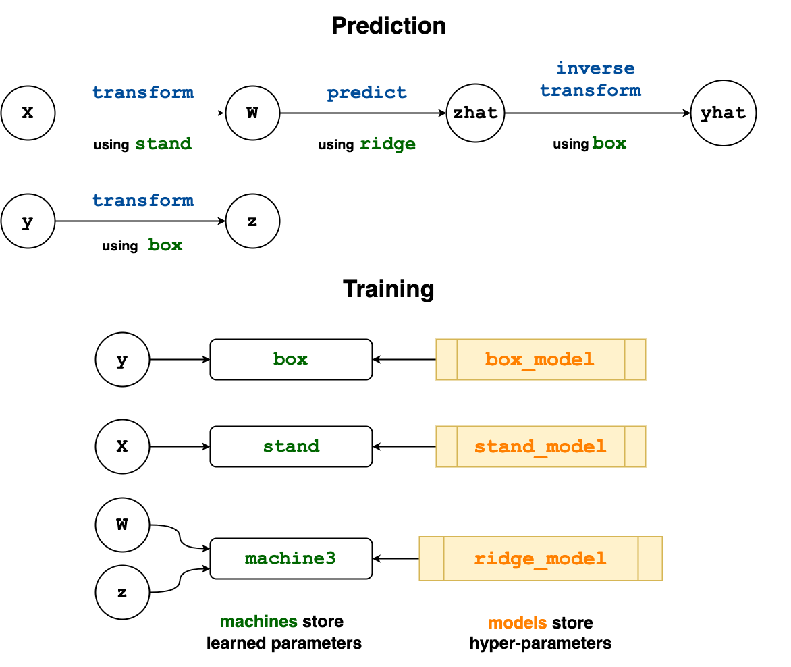

# Composing Models

Three common ways of combining multiple models together
have out-of-the-box implementations in MLJ:

- [Linear Pipelines](@ref) - for unbranching chains that take the
  output of one model (e.g., dimension reduction, such as `PCA`) and
  make it the input of the next model in the chain (e.g., a
  classification model, such as `EvoTreeClassifier`). To include
  transformations of the target variable in a supervised pipeline
  model, see [Target Transformations](@ref).
  
- [Homogeneous Ensembles](@ref) - for blending the predictions of
  multiple supervised models all of the same type, but which receive different
  views of the training data to reduce overall variance. The technique
  is known as observation
  [bagging](https://en.wikipedia.org/wiki/Bootstrap_aggregating). Bagging
  decision trees, like a `DecisionTreeClassifier`, gives what is known
  as a *random forest*, although MLJ also provides several canned
  random forest models.
  
- [Model Stacking](@ref) - for combining the predictions of a smaller
  number of models of possibly *different* type, with the help of an
  adjudicating model.
  
We note that composite models share all of the functionality of
ordinary models. Their main novelty is that they include other models
as hyper-parameters.

Finally, MLJ provides a powerful way to combine machine models in
flexible *learning networks*. By wrapping training data in *source
nodes* before calling functions like `machine`, `predict` and
`transform`, a complicated user workflow which already combines
multiple models is transformed into a blueprint for a new stand-alone
composite model type. For example, MLJ's `Stack` model is implemented
using a learning network. The remainder of this page is devoted to
explaining this advanced feature.

## Learning Networks

Below is a practical guide to the MLJ implementantion of learning
networks, which have been described more abstractly in the article:

[Anthony D. Blaom and Sebastian J. Voller (2020): Flexible model
composition in machine learning and its implementation in MLJ.
Preprint, arXiv:2012.15505](https://arxiv.org/abs/2012.15505)

We assuming familiarity with the basics outlined in [Getting
Started](index.md). The syntax for building a learning network is
essentially an extension of the basic syntax but with data containers
replaced with nodes of a graph.

It is important to distinguish between *learning networks* and the
composite MLJ model types they are used to define.

A *learning network* is a directed acyclic graph whose nodes are
objects that can be called to obtained data, either for training a
machine, or for using as input to an *operation*. An operation is
either:

- *static*, that is, an ordinary function, such as such as `+`, `log` or `vcat`; or

- *dynamic*, that is, an operation such as `predict` or `transform`
  which is dispatched on both data *and* a training outcome attached
  to some machine.

Since the result of calling a node depends on the outcome of
training events (and may involve lazy evaluation) one may think of a
node as "dynamic" data, as opposed to the "static" data appearing in
an ordinary MLJ workflow.

Different operations can dispatch on the same machine (i.e., can
access a common set of learned parameters) and different machines
can point to the same model (allowing for hyperparameter coupling).

By contrast, an *exported learning network* is a
learning network exported as a stand-alone, re-usable `Model` object,
to which all the MLJ `Model` meta-algorithms can be applied
(ensembling, systematic tuning, etc).

By specifying data at the source nodes of a learning network, one can
use and test the learning network as it is defined, which is also a
good way to understand how learning networks work under the hood. This
data, if specified, is ignored in the export process, for the exported
composite model, like any other model, is not associated with any data
until wrapped in a machine.

In MLJ learning networks treat the flow of information during training
and prediction/transforming separately.


### Building a simple learning network

The diagram below depicts a learning network which standardizes the
input data `X`, learns an optimal Box-Cox transformation for the
target `y`, predicts new target values using ridge regression, and
then inverse-transforms those predictions to restore them to the
original scale. (This represents a model we could alternatively build
using the `TransformedTargetModel` wrapper and a pipeline.) Here we
have only dynamic operations, labelled blue. The machines are in
green. Notice that two operations both use `stand`, which stores the
learned standardization scale parameters. The lower "Training" panel
indicates which nodes are used to train each machine, and what model
each machine is associated with.



Looking ahead, we note that the new composite model type we will
create later will be assigned a single hyperparameter `regressor`, and the
learning network model `RidgeRegressor(lambda=0.1)` will become this
parameter's default value. Since model hyperparameters are mutable,
this regressor can be changed to a different one (e.g.,
`HuberRegressor()`).

For testing purposes, we'll use a small synthetic data set:

```@setup 42
using MLJ
MLJ.color_off()
const KNNRegressor = @load KNNRegressor pkg=NearestNeighborModels
```

```@example 42
using Statistics
import DataFrames

x1 = rand(300)
x2 = rand(300)
x3 = rand(300)
y = exp.(x1 - x2 -2x3 + 0.1*rand(300))
X = DataFrames.DataFrame(x1=x1, x2=x2, x3=x3)

train, test  = partition(eachindex(y), 0.8); # hide
```
Step one is to wrap the data in *source nodes*:

```@example 42
Xs = source(X)
ys = source(y)
```

*Note.* One can omit the specification of data at the source nodes (by
writing instead `Xs = source()` and `ys = source()`) and
still export the resulting network as a stand-alone model using the
@from_network macro described later; see the example under [Static
operations on nodes](@ref). However, one will be unable to fit
or call network nodes, as illustrated below.

The contents of a source node can be recovered by simply calling the
node with no arguments:

```@example 42
ys()[1:2]
```

We label the nodes that we will define according to their outputs in
the diagram. Notice that the nodes `z` and `yhat` use the same
machine, namely `box`, for different operations.

To construct the `W` node we first need to define the machine `stand`
that it will use to transform inputs.

```@example 42
stand_model = Standardizer()
stand = machine(stand_model, Xs)
```
Because `Xs` is a node, instead of concrete data, we can call
`transform` on the machine without first training it, and the result
is the new node `W`, instead of concrete transformed data:

```@example 42
W = transform(stand, Xs)
```

To get actual transformed data we *call* the node appropriately, which
will require we first train the node. Training a node, rather than a
machine, triggers training of *all* necessary machines in the network.


```@example 42
fit!(W, rows=train)
W()           # transform all data
W(rows=test ) # transform only test data
W(X[3:4,:])   # transform any data, new or old
```

If you like, you can think of `W` (and the other nodes we will define)
as "dynamic data": `W` is *data*, in the sense that it an be called
("indexed") on rows, but *dynamic*, in the sense the result depends on
the outcome of training events.

The other nodes of our network are defined similarly:

```@example 42
RidgeRegressor = @load RidgeRegressor pkg=MultivariateStats
box_model = UnivariateBoxCoxTransformer()  # for making data look normally-distributed
box = machine(box_model, ys)
z = transform(box, ys)

ridge_model = RidgeRegressor(lambda=0.1)
ridge =machine(ridge_model, W, z)
zhat = predict(ridge, W)

yhat = inverse_transform(box, zhat); 
```
We are ready to train and evaluate the completed network. Notice that
the standardizer, `stand`, is *not* retrained, as MLJ remembers that
it was trained earlier:


```@example 42
fit!(yhat, rows=train);
rms(y[test], yhat(rows=test)) # evaluate
```
We can change a hyperparameters and retrain:

```@example 42
ridge_model.lambda = 0.01
fit!(yhat, rows=train); 
```
And re-evaluate:

```@example 42
rms(y[test], yhat(rows=test))
```

> **Notable feature.** The machine, `ridge::Machine{RidgeRegressor}`, is retrained, because its underlying model has been mutated. However, since the outcome of this training has no effect on the training inputs of the machines `stand` and `box`, these transformers are left untouched. (During construction, each node and machine in a learning network determines and records all machines on which it depends.) This behavior, which extends to exported learning networks, means we can tune our wrapped regressor (using a holdout set) without re-computing transformations each time a `ridge_model` hyperparameter is changed.


### Learning network machines

As we show shortly, a learning network needs to be "exported" to create a
new stand-alone model type. Instances of that type can be bound with
data in a machine, which can then be evaluated, for example. Somewhat
paradoxically, one can wrap a learning network in a certain kind of
machine, called a *learning network machine*, **before** exporting it,
and in fact, the export process actually requires us to do so. Since a
composite model type does not yet exist, one constructs the machine
using a "surrogate" model, whose name indicates the ultimate model
supertype (`Deterministic`, `Probabilistic`, `Unsupervised` or
`Static`). This surrogate model has no fields.

Continuing with the example above:

```@example 42
surrogate = Deterministic()
mach = machine(surrogate, Xs, ys; predict=yhat);
```

Notice that a key-word argument declares which node is for making
predictions, and the arguments `Xs` and `ys` declare which source
nodes receive the input and target data. With `mach` constructed in
this way, the code

```@setup 42
fit!(mach, verbosity=0)
predict(mach, X[test,:]);
```

```julia
fit!(mach)
predict(mach, X[test,:]);
```

is equivalent to

```@setup 42
fit!(yhat, verbosity=0)
yhat(X[test,:]);
```

```julia
fit!(yhat)
yhat(X[test,:]);
```

Like ordinary machine, once can call `report(mach)` and
`fitted_params(mach)`. While it's main purpose is for export (see
below), this machine can even be evaluated:

```@example 42
evaluate!(mach, resampling=CV(nfolds=3), measure=LPLoss(p=2))
```

For more on constructing learning network machines, see
[`machine`](@ref).

A learning network machine can also include additional internal state
in it's report (and so in the report of the corresponding exported
model). See [Exposing internal state of a learning network](@ref) for
this advanced feature.


## Exporting a learning network as a stand-alone model

Having satisfied that our learning network works on the synthetic
data, we are ready to export it as a stand-alone model.


### Method I: The @from_network macro

Having defined a learning network machine, `mach`, as above, the
following code defines a new model subtype `WrappedRegressor <:
Supervised` with a single field `regressor`:

```julia
@from_network mach begin
	mutable struct WrappedRegressor
		regressor=ridge_model
	end
end
```

Note the declaration of the default value `ridge_model`, *which must
refer to an actual model appearing in the learning network*. It can be
typed, as in the alternative declaration below, which also declares
some traits for the type (as shown by `info(WrappedRegressor)`; see
also [Trait declarations](@ref)).

```julia
@from_network mach begin
	mutable struct WrappedRegressor
		regressor::Deterministic=ridge_model
	end
	input_scitype = Table(Continuous,Finite)
	target_scitype = AbstractVector{<:Continuous}
end

```

We can now create an instance of this type and apply the
meta-algorithms that apply to any MLJ model:

```julia
julia> composite = WrappedRegressor()
WrappedRegressor(
	regressor = RidgeRegressor(
			lambda = 0.01))

X, y = @load_boston;
evaluate(composite, X, y, resampling=CV(), measure=l2, verbosity=0)
```

Since our new type is mutable, we can swap the `RidgeRegressor` out
for any other regressor:

```
KNNRegressor = @load KNNRegressor
composite.regressor = KNNRegressor(K=7)
julia> composite
WrappedRegressor(regressor = KNNRegressor(K = 7,
										  algorithm = :kdtree,
										  metric = Distances.Euclidean(0.0),
										  leafsize = 10,
										  reorder = true,
										  weights = :uniform,),) @ 2…63
```


### Method II: Finer control (advanced)

This section describes an advanced feature that can be skipped on a
first reading.

In Method I above, only models appearing in the network will appear as
hyperparameters of the exported composite model. There is a second
more flexible method for exporting the network, which allows finer
control over the exported `Model` struct, and which also avoids
macros. The two steps required are:

- Define a new `mutable struct` model type.

- Wrap the learning network code in a model `fit` method.

Let's start with an elementary illustration in the learning network we
just exported using Method I.

The `mutable struct` definition looks like this:

```@example 42
mutable struct WrappedRegressor2 <: DeterministicComposite
	regressor
end

# keyword constructor
WrappedRegressor2(; regressor=RidgeRegressor()) = WrappedRegressor2(regressor)
nothing #hide
```

The other supertype options are `ProbabilisticComposite`,
`IntervalComposite`, `UnsupervisedComposite` and `StaticComposite`.

We now simply cut and paste the code defining the learning network
into a model `fit` method (as opposed to a machine `fit!` method):


```@example 42
function MLJ.fit(model::WrappedRegressor2, verbosity::Integer, X, y)
	Xs = source(X)
	ys = source(y)

	stand_model = Standardizer()
	stand = machine(stand_model, Xs)
	W = transform(stand, Xs)

	box_model = UnivariateBoxCoxTransformer()
	box = machine(box_model, ys)
	z = transform(box, ys)

	ridge_model = model.regressor        ###
	ridge =machine(ridge_model, W, z)
	zhat = predict(ridge, W)

	yhat = inverse_transform(box, zhat)

	mach = machine(Deterministic(), Xs, ys; predict=yhat)
	return!(mach, model, verbosity)
end
```

This completes the export process.

Notes:

- The line marked `###`, where the new exported model's hyperparameter
  `regressor` is spliced into the network, is the only modification to
  the previous code.

- After defining the network there is the additional step of
  constructing and fitting a learning network machine (see above).

- The last call in the function `return!(mach, model, verbosity)`
  calls `fit!` on the learning network machine `mach` and splits it
  into various pieces, as required by the MLJ model interface. See
  also the [`return!`](@ref) doc-string.

- **Important note** An MLJ `fit` method is not allowed to mutate its
  `model` argument.

> **What's going on here?** MLJ's machine interface is built atop a more primitive *[model](simple_user_defined_models.md)* interface, implemented for each algorithm. Each supervised model type (eg, `RidgeRegressor`) requires model `fit` and `predict` methods, which are called by the corresponding *machine* `fit!` and `predict` methods. We don't need to define a  model `predict` method here because MLJ provides a fallback which simply calls the `predict` on the learning network machine created in the `fit` method.

#### A composite model coupling component model hyper-parameters

We now give a more complicated example of a composite model which
exposes some parameters used in the network that are not simply
component models. The model combines a clustering model (e.g.,
`KMeans()`) for dimension reduction with ridge regression, but has the
following "coupling" of the hyper parameters: The ridge regularization
depends on the number of clusters used (with less regularization for a
greater number of clusters) and a user-specified "coupling"
coefficient `K`.

```@example 42
RidgeRegressor = @load RidgeRegressor pkg=MLJLinearModels

mutable struct MyComposite <: DeterministicComposite
	clusterer     # the clustering model (e.g., KMeans())
	ridge_solver  # a ridge regression parameter we want to expose
	K::Float64    # a "coupling" coefficient
end

function MLJ.fit(composite::Composite, verbosity, X, y)

	Xs = source(X)
	ys = source(y)

	clusterer = composite.clusterer
	k = clusterer.k

	clustererM = machine(clusterer, Xs)
	Xsmall = transform(clustererM, Xs)

	# the coupling: ridge regularization depends on number of
	# clusters (and the specified coefficient `K`):
	lambda = exp(-composite.K/clusterer.k)

	ridge = RidgeRegressor(lambda=lambda, solver=composite.ridge_solver)
	ridgeM = machine(ridge, Xsmall, ys)

	yhat = predict(ridgeM, Xsmall)

	mach = machine(Deterministic(), Xs, ys; predict=yhat)
	return!(mach, composite, verbosity)

end

kmeans = (@load KMeans pkg=Clustering)()
my_composite = MyComposite(kmeans, nothing, 0.5)
```

```@example 42
evaluate(my_composite, X, y, measure=MeanAbsoluteError(), verbosity=0)
```

## Static operations on nodes

Continuing to view nodes as "dynamic data", we can, in addition to
applying "dynamic" operations like `predict` and `transform` to nodes,
overload ordinary "static" (unlearned) operations as well. These
operations can be ordinary functions (with possibly multiple
arguments) or they could be functions *with parameters*, such as "take
a weighted average of two nodes", where the weights are
parameters. Here we address the simpler case of ordinary functions. For
the parametric case, see "Static transformers" in [Transformers and Other Unsupervised Models](@ref)

Let us first give a demonstration of operations that work
out-of-the-box. These include:

- addition and scalar multiplication

- `exp`, `log`, `vcat`, `hcat`

- tabularization (`MLJ.table`) and matrixification (`MLJ.matrix`)

As a demonstration of some of these, consider the learning network
below that: (i) One-hot encodes the input table `X`; (ii) Log
transforms the continuous target `y`; (iii) Fits specified K-nearest
neighbour and ridge regressor models to the data; (iv) Computes an
average of the individual model predictions; and (v) Inverse
transforms (exponentiates) the blended predictions.

Note, in particular, the lines defining `zhat` and `yhat`, which
combine several static node operations.

```@example 42
RidgeRegressor = @load RidgeRegressor pkg=MultivariateStats
KNNRegressor = @load KNNRegressor

Xs = source()
ys = source()

hot = machine(OneHotEncoder(), Xs)

# W, z, zhat and yhat are nodes in the network:

W = transform(hot, Xs) # one-hot encode the input
z = log(ys)            # transform the target

model1 = RidgeRegressor(lambda=0.1)
model2 = KNNRegressor(K=7)

mach1 = machine(model1, W, z)
mach2 = machine(model2, W, z)

# average the predictions of the KNN and ridge models:
zhat = 0.5*predict(mach1, W) + 0.5*predict(mach2, W)

# inverse the target transformation
yhat = exp(zhat)
```

Exporting this learning network as a stand-alone model:

```julia
@from_network machine(Deterministic(), Xs, ys; predict=yhat) begin
	mutable struct DoubleRegressor
		regressor1=model1
		regressor2=model2
	end
end
```

To deal with operations on nodes not supported out-of-the box, one
can use the `@node` macro. Supposing, in the preceding example, we
wanted the geometric mean rather than arithmetic mean. Then, the
definition of `zhat` above can be replaced with

```julia
yhat1 = predict(mach1, W)
yhat2 = predict(mach2, W)
gmean(y1, y2) = sqrt.(y1.*y2)
zhat = @node gmean(yhat1, yhat2)
```

There is also a `node` function, which would achieve the same in this way:

```julia
zhat = node((y1, y2)->sqrt.(y1.*y2), predict(mach1, W), predict(mach2, W))
```

### More `node` examples

Here are some examples taken from MLJ source
(at work in the example above) for overloading common operations for nodes:

```julia
Base.log(v::Vector{<:Number}) = log.(v)
Base.log(X::AbstractNode) = node(log, X)

import Base.+
+(y1::AbstractNode, y2::AbstractNode) = node(+, y1, y2)
+(y1, y2::AbstractNode) = node(+, y1, y2)
+(y1::AbstractNode, y2) = node(+, y1, y2)
```

Here `AbstractNode` is the common super-type of `Node` and `Source`.

And a final example, using the `@node` macro to row-shuffle a table:

```julia
using Random
X = (x1 = [1, 2, 3, 4, 5],
	 x2 = [:one, :two, :three, :four, :five])
rows(X) = 1:nrows(X)

Xs = source(X)
rs  = @node rows(Xs)
W = @node selectrows(Xs, @node shuffle(rs))

julia> W()
(x1 = [5, 1, 3, 2, 4],
 x2 = Symbol[:five, :one, :three, :two, :four],)

```

## Exposing internal state of a learning network 

This section describes an advanced feature. 

Suppose you have a learning network that you would like to export as
a new stand-alone model type `MyModel`. Having bound `MyModel` to some
data in a machine `mach`, you would like to arrange that
`report(mach)` will record some additional information about the
internal state of the learning network that was built internally, when
you called `fit!(mach)`. This is possible by specifying the relevant
node or nodes when constructing the associated learning network
machine (see [Learning network machines](@ref) above) by including
the `report` keyword argument, as in 

```julia
mach = machine(Probabilistic(), Xs, ys, predict=yhat, report=(mean=N1, stderr=N2))
```

Here, `yhat`, `N1` and `N2` are nodes in the learning network and
`mean` and `stderr` are the desired key names for the machine's
report. After training this machine, `report(mach).mean` will return
the value of `N1()` when the underlying learning network was trained,
while `report(mach).stderr` will return the value of `N2()`.


Note that as `N1` and `N2` are called with no arguments, they do not
see "production" data, which is a point of difference with the
`predict` node `yhat`, which is called on the production data `Xnew`
on a call such as `predict(mach, Xnew)`. However, this also means the
nodes can have multiple origin nodes (query `origins` for
details). This is indeed the case in the following dummy example,
recording a training error in the composite model report:

```julia
using MLJ

import MLJModelInterface

struct MyModel <: ProbabilisticComposite
    model
end

function MLJModelInterface.fit(composite::MyModel, verbosity, X, y)

    Xs = source(X)
    ys = source(y)

    mach = machine(composite.model, Xs, ys)
    yhat = predict(mach, Xs)
    e = @node auc(yhat, ys)   # <------  node whose state we wish to export

    network_mach = machine(Probabilistic(),
                           Xs,
                           ys,
                           predict=yhat,
                           report=(training_error=e,))  # <------ how we export additional node(s)

    return!(network_mach, composite, verbosity)
end

X, y = make_moons()
composite = MyModel(ConstantClassifier())
mach = machine(composite, X, y) |> fit!
err = report(mach).training_error    # <------ accesssing the node state

yhat = predict(mach, rows=:);
@assert err ≈ auc(yhat, y) # true
```

## The learning network API

Two new julia types are part of learning networks: `Source` and `Node`.

Formally, a learning network defines *two* labeled directed acyclic
graphs (DAG's) whose nodes are `Node` or `Source` objects, and whose
labels are `Machine` objects. We obtain the first DAG from directed
edges of the form $N1 -> N2$ whenever $N1$ is an *argument* of $N2$
(see below). Only this DAG is relevant when calling a node, as
discussed in examples above and below. To form the second DAG
(relevant when calling or calling `fit!` on a node) one adds edges for
which $N1$ is *training argument* of the the machine which labels
$N1$. We call the second, larger DAG, the *completed learning network*
(but note only edges of the smaller network are explicitly drawn in
diagrams, for simplicity).


### Source nodes

Only source nodes reference concrete data. A `Source` object has a
single field, `data`.

```@docs
source(X)
rebind!
sources
origins
```

### Nodes

The key components of a `Node` are:

- An *operation*, which will either be *static* (a fixed function) or
  *dynamic* (such as `predict` or `transform`, dispatched on a machine).

- A *machine* on which to dispatch the operation (void if the
  operation is static). The training arguments of the machine are
  generally other nodes.

- Upstream connections to other nodes (including source nodes)
  specified by *arguments* (one for each argument of the operation).

```@docs
node
```

```@docs
@node
```

```@docs
@from_network
```

```@docs
return!
```

See more on fitting nodes at [`fit!`](@ref) and [`fit_only!`](@ref).
