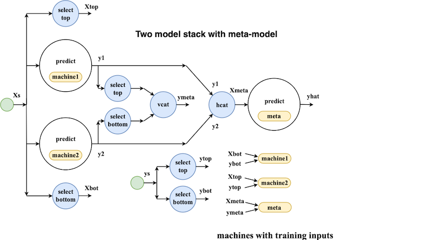

# Beyond machine learning pipelines with MLJ

Anthony Blaom, Diego Arenas, Franz Kiraly, Yiannis Simillides, Sebastian Vollmer

**May 1st, 2019.** Blog post also posted on the [Julia Language Blog](https://julialang.org/blog/2019/05/beyond-ml-pipelines-with-mlj)


 | 
------------------------|--------------------------
  | 


## Introduction

[MLJ](https://github.com/alan-turing-institute/MLJ.jl) is an
open-source machine learning toolbox written in pure Julia. It
provides a uniform interface for interacting with supervised and
unsupervised learning models currently scattered in different Julia
packages.

Building on a earlier proof-of-concept, development began in earnest
at [The Alan Turing Institute](https://www.turing.ac.uk) in
December 2018. In a short time interest grew and the project is now
the Institute's most starred software repository.

After outlining MLJ's current functionality, this post introduces MLJ
**learning networks**, a super-charged pipelining feature for model
composition.

**Quick links:**

- [MLJ vs ScikitLearn.jl](https://alan-turing-institute.github.io/MLJ.jl/dev/frequently_asked_questions/)  

- Video from [London Julia User Group meetup in March 2019](https://www.youtube.com/watch?v=CfHkjNmj1eE) (skip to [demo at 21'39](https://youtu.be/CfHkjNmj1eE?t=21m39s)) &nbsp;

- The MLJ [tour](https://github.com/alan-turing-institute/MLJ.jl/blob/master/docs/src/tour.ipynb)

- Building a [self-tuning random forest](https://github.com/alan-turing-institute/MLJ.jl/blob/master/examples/random_forest.ipynb)

- An MLJ [docker image](https://github.com/ysimillides/mlj-docker) (including tour)

- Implementing the MLJ interface for a [new model](https://alan-turing-institute.github.io/MLJ.jl/dev/adding_models_for_general_use/)

- How to [contribute](https://github.com/alan-turing-institute/MLJ.jl/blob/master/CONTRIBUTE.md)

- Julia [Slack](http://julialang.slack.com) channel: \#mlj.

- Star'ing us to show support for [MLJ](https://github.com/alan-turing-institute/MLJ.jl) would be greatly appreciated!


## MLJ features

MLJ already has substantial functionality:

- **Learning networks.** Flexible model composition beyond traditional
  pipelines (more on this below).

- **Automatic tuning.** Automated tuning of hyperparameters, including
  composite models. Tuning implemented as a model wrapper for
  composition with other meta-algorithms.

- **Homogeneous model ensembling.**

- **Registry for model metadata.** Metadata available without loading
  model code. Basis of a "task" interface and facilitates
  model composition.

- **Task interface.** Automatically match models to specified learning
  tasks, to streamline benchmarking and model selection.

- **Clean probabilistic API.** Improves support for Bayesian
  statistics and probabilistic graphical models.

- **Data container agnostic.** Present and manipulate data in your
  favorite Tables.jl format.

- **Universal adoption of categorical data types.** Enables model
  implementations to properly account for classes seen in training but
  not in evaluation.

Enhancements planned for the near future include integration of
Flux.jl **deep learning** models, and **gradient descent tuning** of
continuous hyperparameters using automatic differentiation.

While a relatively small number of machine learning models currently
implement the MLJ interface, work in progress aims to wrap models
supported by the popular python framework, scikit-learn, as a
temporary expedient. For a comparison of the MLJ's design with the
Julia wrap [ScitLearn.jl](https://github.com/cstjean/ScikitLearn.jl),
see this
[FAQ](https://github.com/alan-turing-institute/MLJ.jl/blob/master/docs/src/frequently_asked_questions.md).


## Learning networks

MLJ's model composition interface is flexible enough to implement, for
example, the [model
stacks](https://www.kdnuggets.com/2017/02/stacking-models-imropved-predictions.html)
popular in data science competitions. To treat examples of this kind,
the interface design must account for the fact that information flow
in prediction and training modes is different. This can be seen from
the following schematic of a simple two-model stack, viewed as a
network:



## Building a simple network

In MLJ, networks of models are built using a declarative syntax
already familiar from basic use of the package. For example, the
ordinary syntax for training a decision tree in MLJ, after one-hot
encoding the categorical features, looks like this:

```julia
using MLJ
@load DecisionTreeRegressor

# load some data:
task = load_reduced_ames();
X, y = task();

# one-hot encode the inputs, X:
hot_model = OneHotEncoder()
hot = machine(hot_model, X)
fit!(hot)
Xt = transform(hot, X)

# fit a decision tree to the transformed data:
tree_model = DecisionTreeRegressor()
tree = machine(tree_model, Xt, y)
fit!(tree, rows = 1:1300)
```

Note that a *model* in MLJ is just a struct containing
hyperparameters. Wrapping a model in data delivers a *machine* struct,
which will additionally record the results of training.

Without a pipeline, each time we want to present new data for
prediction we must first apply one-hot encoding:

```julia
Xnew = X[1301:1400,:];
Xnewt = transform(hot, Xnew);
yhat = predict(tree, Xnewt);
yhat[1:3]
 3-element Array{Float64,1}:
  223956.9999999999
  320142.85714285733
  161227.49999999994
```

To build a pipeline one simply wraps the supplied data in source nodes
and repeats similar declarations, omitting calls to
`fit!`. The difference now is that each "variable" (e.g., `Xt`,
`yhat`) is a node of our pipeline, instead of concrete data:

```julia
Xs = source(X)
ys = source(y)

hot = machine(hot_model, Xs)
Xt = transform(hot, Xs);

tree = machine(tree_model, Xt, ys)
yhat = predict(tree, Xt)
```

If we like, we can think of a node as *dynamic data* - "data" because
it can be called (indexed) on rows, but "dynamic" because the result
depends on the outcome of training events, which in turn depend on
hyperparameter values. For example, after fitting the completed pipeline,
we can make new predictions like this:

```julia
fit!(yhat, rows=1:1300)
 [ Info: Training NodalMachine @ 1…51.
 [ Info: Spawned 1300 sub-features to one-hot encode feature :Neighborhood.
 [ Info: Spawned 1300 sub-features to one-hot encode feature :MSSubClass.
 [ Info: Training NodalMachine @ 1…17.
 Node @ 1…79 = predict(1…17, transform(1…51, 1…07))

yhat(rows=1301:1302) # to predict on rows of source node
yhat(Xnew)           # to predict on new data
156-element Array{Float64,1}:
 223956.9999999999
 320142.85714285733
 ...
```


## Exporting and retraining

Once a pipeline like this has been built and tested on sample data, it
can be exported as a stand-alone model, ready to be trained on any
dataset. For details, see the MLJ
[documentation](https://alan-turing-institute.github.io/MLJ.jl/dev/learning_networks/). In
the future, Julia macros will allow common architectures (e.g., linear
pipelines) to be built in a couple of lines.

Finally, we mention that MLJ learning networks, and their exported
counterparts, are "smart" in the sense that changing a hyperparameter
does not trigger retraining of component models upstream of the
change:

```julia
tree_model.max_depth = 4
fit!(yhat, rows=1:1300)
 [ Info: Not retraining NodalMachine @ 1…51. It is up-to-date.
 [ Info: Updating NodalMachine @ 1…17.
 Node @ 1…79 = predict(1…17, transform(1…51, 1…07))
```


## Just "Write the math!"

Because of Julia's generic programming features, any kind of operation
you would normally apply to data (arithmetic, row selection, column
concatenation, etc) can be overloaded to work with nodes. In this way,
MLJ's network-building syntax is economical, intuitive and easy to
read. In this respect we have been inspired by [On Machine Learning
and Programming Languages](https://julialang.org/blog/2017/12/ml&pl).

## Invitation to the community
We now invite the community to try out our newly registered packages, [MLJ](https://github.com/alan-turing-institute/MLJ.jl)alongside [MLJModels](https://github.com/alan-turing-institute/MLJModels.jl), and provide any feedback or suggestions you may have going forward. We are also particularly interested in hearing how you would use our package, and what features it may be lacking.
