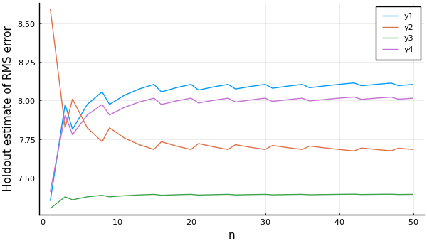

# Learning Curves

A *learning curve* in MLJ is a plot of some performance estimate, as a
function of some model hyperparameter. This can be useful when tuning
a single model hyperparameter, or when deciding how many iterations
are required for some iterative model. The `learning_curve` method
does not actually generate a plot, but generates the data needed to do
so.

To generate learning curves you can bind data to a model by
instantiating a machine. You can choose to supply all available data,
as performance estimates are computed using a resampling strategy,
defaulting to `Holdout(fraction_train=0.7)`.

```julia
X, y = @load_boston;

atom = @load RidgeRegressor pkg=MultivariateStats
ensemble = EnsembleModel(atom=atom, n=1000)
mach = machine(ensemble, X, y)

r_lambda = range(ensemble, :(atom.lambda), lower=10, upper=500, scale=:log10)
curve = MLJ.learning_curve(mach;
                           range=r_lambda,
                           resampling=CV(nfolds=3),
                           measure=mav)
using Plots
plot(curve.parameter_values,
     curve.measurements,
     xlab=curve.parameter_name,
     xscale=curve.parameter_scale,
     ylab = "CV estimate of RMS error")
```


In the case the `range` hyperparameter is the number of iterations in
some iterative model, `learning_curve` will not restart the training
from scratch for each new value, unless a non-holdout `resampling`
strategy is specified (and provided the model implements an
appropriate `update` method). To obtain multiple curves (that are
distinct) you will need to pass the name of the model random number
generator, `rng_name`, and specify the random number generators to be
used using `rngs=...` (an integer automatically generates the number
specified):

```julia
atom.lambda=200
r_n = range(ensemble, :n, lower=1, upper=50)
curves = MLJ.learning_curve(mach;
                             range=r_n,
                             verbosity=0,
                             rng_name=:rng,
                             rngs=4)
plot(curves.parameter_values,
     curves.measurements,
     xlab=curves.parameter_name,
     ylab="Holdout estimate of RMS error")
```




## API reference

```@docs
MLJTuning.learning_curve
```
