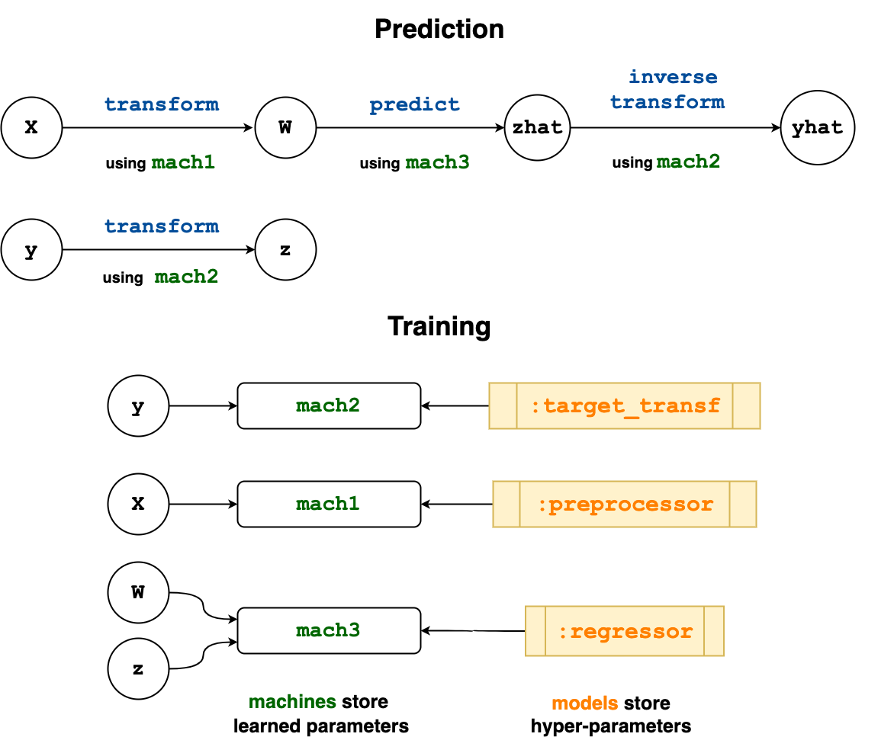

# Learning Networks

Below is a practical guide to the MLJ implementation of learning
networks, which have been described more abstractly in the article:

[Anthony D. Blaom and Sebastian J. Voller (2020): Flexible model
composition in machine learning and its implementation in MLJ.
Preprint, arXiv:2012.15505](https://arxiv.org/abs/2012.15505).

*Learning networks*, an advanced but powerful MLJ feature, are "blueprints" for combining
models in flexible ways, beyond ordinary linear pipelines and simple model ensembles. They
are simple transformations of your existing workflows which can be "exported" to define
new, re-usable composite model types (models which typically have other models as
hyperparameters).

Pipeline models (see [`Pipeline`](@ref)), and model stacks (see [`Stack`](@ref)) are both
implemented internally as exported learning networks.

!!! note

    While learning networks can be used for complex machine learning workflows, their main
    purpose is for defining new stand-alone model types, which behave just like any other
    model type: Instances can be evaluated, tuned, inserted into pipelines, etc.  In serious
    applications, users are encouraged to export their learning networks, as explained under
    [Exporting a learning network as a new model type](@ref) below, **after testing the
    network**, using a small training dataset.


## Learning networks by example

Learning networks are best explained by way of example.

### Lazy computation

The core idea of a learning network is delayed or *lazy* computation. Instead of

```@setup 42
using MLJ
MLJ.color_off()
```

```@example 42
X = 4
Y = 3
Z = 2*X
W = Y + Z
W
```

we can do

```@example 42
using MLJ

X = source(4)
Y = source(9)
Z = 2*X
W = Y + Z
W()
```

In the first computation `X`, `Y`, `Z` and `W` are all bound to ordinary data. In the
second, they are bound to objects called *nodes*. The special nodes `X` and `Y` constitute
"entry points" for data, and are called *source nodes*. As the terminology suggests, we
can imagine these objects as part of a "network" (a directed acyclic graph) which can aid
conceptualization (but is less useful in more complicated examples):


### The origin of a node

The source nodes on which a given node depends are called the
*origins* of the node:

```@example 42
os = origins(W)
```

```@example 42
X in os
```


### Re-using a network

The advantage of lazy evaluation is that we can change data at a source node to repeat the
calculation with new data. One way to do this (discouraged in practice) is to use
`rebind!`:

```@example 42
rebind!(Z, 6) # demonstration only!
Z()
```

However, if a node has a unique origin, then one instead *calls* the node on the new data one
would like to rebind to that origin:

```@example 42
origins(Z)
```

```@example 42
Z(6)
```

This has the advantage that you don't need to locate the origin and rebind data directly,
and the unique-origin restriction turns out to be sufficient for the applications to
learning we have in mind.

### [Overloading functions for use on nodes](@id node_overloading)

Several built-in function like `*` and `+` above are overloaded in MLJBase to work on
nodes, as illustrated above. Others that work out-of-the-box include: `MLJBase.matrix`,
`MLJBase.table`, `vcat`, `hcat`, `mean`, `median`, `mode`, `first`, `last`, as well as
broadcasted versions of `log`, `exp`, `mean`, `mode` and `median`. A function like `sqrt`
is not overloaded, so that `Q = sqrt(Z)` will throw an error. Instead, we do

```@example 42
Q = node(z->sqrt(z), Z)
Z()
```

```@example 42
Q()
```

You can learn more about the `node` function under [More on defining new nodes](@ref) 

### A network that learns

To incorporate learning in a network of nodes MLJ:

- Allows binding of machines to nodes instead of data

- Generates "operation" nodes when calling an operation like `predict` or `transform` on a
  machine and node input data. Such nodes point to both a machine (storing learned
  parameters) and the node from which to fetch data for applying the operation (which,
  unlike the nodes seen so far, depend on learned parameters to generate output).

For an example of a learning network that actually learns, we first synthesize some
training data `X`, `y`, and production data `Xnew`:

```@example 42
using MLJ
X, y = make_blobs(cluster_std=10.0, rng=123)  # `X` is a table, `y` a vector
Xnew, _ = make_blobs(3) # `Xnew` is a table with the same number of columns
nothing # hide
```

We choose a model do some dimension reduction, and another to perform classification:

```@example 42
pca = (@load PCA pkg=MultivariateStats verbosity=0)()
tree = (@load DecisionTreeClassifier pkg=DecisionTree verbosity=0)()
nothing # hide
```

To make our learning lazy, we wrap the training data as source nodes:

```@example 42
Xs = source(X)
ys = source(y)
nothing # hide
```

And, finally, proceed as we would in an ordinary MLJ workflow, with the exception that
there is no need to `fit!` our machines, as training will be carried out lazily later:

```@example 42
mach1 = machine(pca, Xs)
x = transform(mach1, Xs) # defines a new node because `Xs` is a node

mach2 = machine(tree, x, ys)
yhat = predict(mach2, x) # defines a new node because `x` is a node
```

Note that `mach1` and `mach2` are not themselves nodes. They *point* to the nodes they
need to *call* to get training data and they are in turn *pointed to* by other nodes. In
fact, an interesting implementation detail is that an "ordinary" machine is not actually
bound directly to data, but bound to data wrapped in source nodes.

```@example 42
machine(pca, Xnew).args[1] # `Xnew` is ordinary data
```

Before calling a node, we need to `fit!` the node, to trigger training of all the machines
on which it depends:

```@repl 42
fit!(yhat)   # can include same keyword options for `fit!(::Machine, ...)`
yhat()[1:2]  # or `yhat(rows=2)`
```

This last represents the prediction on the *training* data, because that's what resides at
our source nodes. However, `yhat` has the unique origin `X` (because "training edges" in
the complete associated directed graph are excluded for this purpose). We can therefore
call `yhat` on our production data to get the corresponding predictions:

```@example 42
yhat(Xnew)
```

Training is smart, in the sense that mutating a hyper-parameter of some component model
does not force retraining of upstream machines:

```@repl 42
tree.max_depth = 1
fit!(yhat)
yhat(Xnew)
```

### Multithreaded training

A more complicated learning network may contain machines that can be trained in
parallel. In that case, a call like the following may speed up training:

```@example 42
tree.max_depth=2
fit!(yhat, acceleration=CPUThreads())
nothing # hide
```

Currently, only `CPU1()` (default) and `CPUThreads()` are supported here.

## Exporting a learning network as a new model type

Once a learning network has been tested, typically on some small dummy data set, it is
ready to be exported as a new, stand-alone, re-usable model type (unattached to any
data). We demonstrate the process by way of examples of increasing complexity:

- [Example A - Mini-pipeline](@ref)
- [More on replacing models with symbols](@ref)
- [Example B - Multiple operations: transform and inverse transform](@ref)
- [Example C - Exposing internal network state in reports](@ref)
- [Example D - Multiple nodes pointing to the same machine](@ref)
- [Example E - Coupling component model hyper-parameters](@ref)
- [More on defining new nodes](@ref)
- [Example F - Wrapping a model in a data-dependent tuning strategy](@ref)


### Example A - Mini-pipeline

First we export the simple learning network defined above. (This is for illustration
purposes; in practice using the [`Pipeline`](@ref) syntax `model1 |> model2` syntax is
more convenient.)

#### Step 1 - Define a new model struct

We need a type with two fields, one for the preprocessor (`pca` in the network above)
and one for the classifier (`tree` in the network above).

The `DecisionTreeClassifier` type of `tree` has supertype `Probabilistic`, because it
makes probabilistic predictions, and we assume any other classifier we want to swap out
will be the same.

```@example 42
supertype(typeof(tree))
```

In particular, our composite model will also need `Probabilistic` as supertype. In fact,
we must give it the intermediate supertype `ProbabilisticNetworkComposite <:
Probabilistic`, so that we additionally flag it as an exported learning network model
type:

```@example 42
mutable struct CompositeA <: ProbabilisticNetworkComposite
    preprocessor
    classifier
end
```

The common alternatives are `DeterministicNetworkComposite` and
`UnsupervisedNetworkComposite`. But all options can be viewed as follows:

```@example 42
using MLJBase
NetworkComposite
```

We next make our learning network model-generic by *substituting each model instance
with the corresponding **symbol** representing a property (field) of the new model
struct*:

```@example 42
mach1 = machine(:preprocessor, Xs)   # <---- `pca` swapped out for `:preprocessor`
x = transform(mach1, Xs)
mach2 = machine(:classifier, x, ys)  # <---- `tree` swapped out for `:classifier`
yhat = predict(mach2, x)
```

Incidentally, this network can be used as before except we must provide an instance of
`CompositeA` in our `fit!` calls, to indicate what actual models the symbols are being
substituted with:

```@example 42
composite_a = CompositeA(pca, ConstantClassifier())
fit!(yhat, composite=composite_a)
yhat(Xnew)
```

In this case `:preprocessor` is being substituted by `pca`, and `:classifier` by
`ConstantClassifier()` for training.

#### Step 2 - Wrap the learning network in `prefit`

Literally copy and paste the learning network above into the definition of a method called
`prefit`, as shown below (if you have implemented your own MLJ model, you will notice this
has the same signature as `MLJModelInterface.fit`):

```@example 42
import MLJBase
function MLJBase.prefit(composite::CompositeA, verbosity, X, y)

        # the learning network from above:
        Xs = source(X)
        ys = source(y)
        mach1 = machine(:preprocessor, Xs)
        x = transform(mach1, Xs)
        mach2 = machine(:classifier, x, ys)
        yhat = predict(mach2, x)

        verbosity > 0 && @info "I'm a noisy fellow!"

        # return "learning network interface":
        return (; predict=yhat)
end
```

That's it.

Generally, `prefit` always returns a *learning network interface*; see
[`MLJBase.prefit`](@ref) for what this means in general. In this example, the interface
dictates that calling `predict(mach, Xnew)` on a machine `mach` bound to some instance of
`CompositeA` should internally call `yhat(Xnew)`.

Here's our new composite model type `CompositeA` in action, combining standardization with
KNN classification:

```@example 42
using MLJ
X, y = @load_iris

knn = (@load KNNClassifier pkg=NearestNeighborModels verbosity=0)()
composite_a = CompositeA(Standardizer(), knn)
```

```@example 42
mach = machine(composite_a, X, y) |> fit!
predict(mach, X)[1:2]
```

```@example 42
report(mach).preprocessor
```

```@example 42
fitted_params(mach).classifier
```

### More on replacing models with symbols

Only the first argument `model` in some expression `machine(model, ...)` can be replaced
with a symbol. These replacements function as hooks for exposing reports and fitted
parameters of component models in the report and fitted parameters of the composite model,
but these replacements are not absolutely necessary. For example, instead of the line
`mach1 = machine(:preprocessor, Xs)` in the `prefit` definition, we can do `mach1 =
machine(composite.preprocessor, Xs)`. However, `report` and `fittted_params` will not
include items for the `:preprocessor` component model in that case.

If a component model is not explicitly bound to data in a machine (for example, because it
is first wrapped in `TunedModel`) then there are ways to explicitly expose associated
fitted parameters or report items. See Example F below.

### Example B - Multiple operations: transform and inverse transform

Here's a second mini-pipeline example composing two transformers which both implement
inverse transform. We show how to implement an `inverse_transform` for the composite model
too.

#### Step 1 - Define a new model struct

```@example 42
using MLJ
import MLJBase

mutable struct CompositeB <: DeterministicNetworkComposite
    transformer1
    transformer2
end
```

#### Step 2 - Wrap the learning network in `prefit`

```@example 42
function MLJBase.prefit(composite::CompositeB, verbosity, X)
    Xs = source(X)

    mach1 = machine(:transformer1, Xs)
    X1 = transform(mach1, Xs)
    mach2 = machine(:transformer2, X1)
    X2 = transform(mach2, X1)

    W1 = inverse_transform(mach2, Xs)
    W2 = inverse_transform(mach1, W1)

    # the learning network interface:
    return (; transform=X2, inverse_transform=W2)
end
```

Here's a demonstration:

```julia
X = rand(100)

composite_b = CompositeB(UnivariateBoxCoxTransformer(), Standardizer())
mach = machine(composite_b, X) |> fit!
W =  transform(mach, X)
@assert inverse_transform(mach, W) ≈ X
```

### Example C - Exposing internal network state in reports

The code below defines a new composite model type `CompositeC` that predicts by taking the
weighted average of two regressors, and additionally exposes, in the model's report, a
measure of disagreement between the two models at time of training. In addition to the two
regressors, the new model has two other fields:

- `mix`, controlling the weighting

- `acceleration`, for the mode of acceleration for training the model (e.g.,
  `CPUThreads()`).

#### Step 1 - Define a new model struct

```@example 42
using MLJ
import MLJBase

mutable struct CompositeC <: DeterministicNetworkComposite
    regressor1
    regressor2
    mix::Float64
    acceleration
end
```

#### Step 2 - Wrap the learning network in `prefit`

```@example 42
function MLJBase.prefit(composite::CompositeC, verbosity, X, y)

    Xs = source(X)
    ys = source(y)

    mach1 = machine(:regressor1, Xs, ys)
    mach2 = machine(:regressor2, Xs, ys)

    yhat1 = predict(mach1, Xs)
    yhat2 = predict(mach2, Xs)

    # node to return disagreement between the regressor predictions:
    disagreement = node((y1, y2) -> l2(y1, y2) |> mean, yhat1, yhat2)

    # get the weighted average the predictions of the regressors:
    λ = composite.mix
    yhat = (1 - λ)*yhat1 + λ*yhat2

    # the learning network interface:
    return (
        predict = yhat,
        report= (; training_disagreement=disagreement),
        acceleration = composite.acceleration,
    )

end
```

Here's a demonstration:

```@example 42
X, y = make_regression() # a table and a vector

knn = (@load KNNRegressor pkg=NearestNeighborModels verbosity=0)()
tree =  (@load DecisionTreeRegressor pkg=DecisionTree verbosity=0)()
composite_c = CompositeC(knn, tree, 0.2, CPUThreads())
mach = machine(composite_c, X, y) |> fit!
Xnew, _ = make_regression(3)
predict(mach, Xnew)
```

```@example 42
report(mach)
```

### Example D - Multiple nodes pointing to the same machine

When incorporating learned target transformations (such as a standardization) in supervised
learning, it is desirable to apply the *inverse* transformation to predictions, to return
them to the original scale. This means re-using learned parameters from an earlier part of
your workflow. This poses no problem here, as the next example demonstrates.

The model type `CompositeD` defined below applies a preprocessing transformation to input
data `X` (e.g., standardization), learns a transformation for the target `y` (e.g., an
optimal Box-Cox transformation), predicts new target values using a regressor (e.g., Ridge
regression), and then inverse-transforms those predictions to restore them to the original
scale. (This represents a model we could alternatively build using the
[`TransformedTargetModel`](@ref) wrapper and a [`Pipeline`](@ref).)

#### Step 1 - Define a new model struct

```@example 42
using MLJ
import MLJBase

mutable struct CompositeD <: DeterministicNetworkComposite
    preprocessor
    target_transformer
    regressor
    acceleration
end
```

#### Step 2 - Wrap the learning network in `prefit`

Notice that both of the nodes `z` and `yhat` in the wrapped learning network point to the
same machine (learned parameters) `mach2`.

```@example 42
function MLJBase.prefit(composite::CompositeD, verbosity, X, y)

    Xs = source(X)
    ys = source(y)

    mach1 = machine(:preprocessor, Xs)
    W = transform(mach1, Xs)

    mach2 = machine(:target_transformer, ys)
    z = transform(mach2, ys)

    mach3 =machine(:regressor, W, z)
    zhat = predict(mach3, W)

    yhat = inverse_transform(mach2, zhat)

    # the learning network interface:
    return (
        predict = yhat,
        acceleration = composite.acceleration,
    )

end
```

The flow of information in the wrapped learning network is visualized below.



Here's an application of our new composite to the Boston dataset:

```@example 42
X, y = @load_boston

stand = Standardizer()
box = UnivariateBoxCoxTransformer()
ridge = (@load RidgeRegressor pkg=MultivariateStats verbosity=0)(lambda=92)
composite_d = CompositeD(stand, box, ridge, CPU1())
evaluate(composite_d, X, y, resampling=CV(nfolds=5), measure=l2, verbosity=0)
```

### Example E - Coupling component model hyper-parameters

The composite model in this example combines a clustering model used to reduce the
dimension of the feature space (`KMeans` or `KMedoids` from Clustering.jl) with ridge
regression, but has the following "coupling" of the hyperparameters: The amount of ridge
regularization depends on the number of specified clusters `k`, with less regularization
for a greater number of clusters. It includes a user-specified coupling coefficient `c`,
and exposes the `solver` hyper-parameter of the ridge regressor. (Neither the clusterer
nor ridge regressor are themselves hyperparameters of the composite.)

#### Step 1 - Define a new model struct

```@example 42
using MLJ
import MLJBase

mutable struct CompositeE <: DeterministicNetworkComposite
        clusterer     # `:kmeans` or `:kmedoids`
        k::Int        # number of clusters
        solver        # a ridge regression parameter we want to expose
        c::Float64    # a "coupling" coefficient
end
```

#### Step 2 - Wrap the learning network in `prefit`

```@example 42
RidgeRegressor = @load RidgeRegressor pkg=MLJLinearModels verbosity=0
KMeans   = @load KMeans pkg=Clustering verbosity=0
KMedoids = @load KMedoids pkg=Clustering verbosity=0

function MLJBase.prefit(composite::CompositeE, verbosity, X, y)

        Xs = source(X)
        ys = source(y)

        k = composite.k
        solver = composite.solver
        c = composite.c

        clusterer = composite.clusterer == :kmeans ? KMeans(; k) : KMedoids(; k)
        mach1 = machine(clusterer, Xs)
        Xsmall = transform(mach1, Xs)

        # the coupling - ridge regularization depends on the number of
        # clusters `k` and the coupling coefficient `c`:
        lambda = exp(-c/k)

        ridge = RidgeRegressor(; lambda, solver)
        mach2 = machine(ridge, Xsmall, ys)
        yhat = predict(mach2, Xsmall)

        return (predict=yhat,)
end
```

Here's an application to the Boston dataset in which we optimize the coupling coefficient
(see [Tuning Models](@ref) for more on hyper-parameter optimization):

```@example 42
X, y = @load_boston # a table and a vector

composite_e = CompositeE(:kmeans, 3, nothing, 0.5)
r = range(composite_e, :c, lower = -2, upper=2, scale=x->10^x)
tuned_composite_e = TunedModel(
    composite_e,
    range=r,
    tuning=RandomSearch(rng=123),
    measure=l2,
    resampling=CV(nfolds=6),
    n=100,
)
mach = machine(tuned_composite_e, X, y) |> fit!
report(mach).best_model
```

## More on defining new nodes

Overloading ordinary functions for nodes has already been discussed [above](@ref
node_overloading). Here's another example:

```@example 42
divide(x, y) = x/y

X = source(2)
Y = source(3)

Z = node(divide, X, Y)
nothing # hide
```

This means `Z()` returns `divide(X(), Y())`, which is `divide(2, 3)` in this case:

```@example 42
Z()
```

We cannot call `Z` with arguments (e.g., `Z(2)`) because it does not have a unique origin.

In all the `node` examples so far, the first argument of `node` is a function, and all
other arguments are nodes - one node for each argument of the function. A node constructed
in this way is called a *static* node. A *dynamic* node, which directly depends on the
outcome of a training event, is constructed by giving a *machine* as the second argument,
to be passed as the first argument of the function in a node call. For example, we can do

```@example 42
Xs = source(rand(4))
mach = machine(Standardizer(), Xs)
N = node(transform, mach, Xs) |> fit!
nothing # hide
```

Then `N` has the following calling properties:

- `N()` returns `transform(mach, Xs())`
- `N(Xnew)` returns `transform(mach, Xs(Xnew))`; here `Xs(Xnew)` is just `Xnew` because
  `Xs` is just a source node.)

```@example 42
N()
```
```@example 42
N(rand(2))
```

In fact, this is precisely how the `transform` method is internally overloaded to work,
when called with a node argument (to return a node instead of data). That is, internally
there exists code that amounts to the definition

```julia
transform(mach, X::AbstractNode) = node(transform, mach, X)
```

Here `AbstractNode` is the common super-type of `Node` and `Source`.

It sometimes useful to create dynamic nodes with *no* node arguments, as in

```@example 42
Xs = source(rand(10))
mach = machine(Standardizer(), Xs)
N = node(fitted_params, mach) |> fit!
N()
```

Static nodes can have also have zero node arguments. These may be viewed as "constant"
nodes:

```@example 42
N = Node(()-> 42)
N()
```

Example F below demonstrates the use of static and dynamic nodes. For more details, see
the [`node`](@ref) docstring.

There is also an experimental macro [`@node`](@ref). If `Z` is an `AbstractNode` (`Z =
source(16)`, say) then instead of

```julia
Q = node(z->sqrt(z), Z)
```

one can do

```julia
Q = @node sqrt(Z)
```

(so that `Q() == 4`). Here's a more complicated application of `@node` to row-shuffle a
table:

```julia
using Random
X = (x1 = [1, 2, 3, 4, 5],
         x2 = [:one, :two, :three, :four, :five])
rows(X) = 1:nrows(X)

Xs = source(X)
rs  = @node rows(Xs)
W = @node selectrows(Xs, @node shuffle(rs))

julia> W()
(x1 = [5, 1, 3, 2, 4],
 x2 = Symbol[:five, :one, :three, :two, :four],)

```

**Important.** An argument not in global scope is assumed by `@node` to be a node or
source.


### Example F - Wrapping a model in a data-dependent tuning strategy

When the regularization parameter of a [Lasso
model](https://en.wikipedia.org/wiki/Lasso_(statistics)) is optimized, one commonly
searches over a parameter range depending on properties of the training data. Indeed,
Lasso (and, more generally, elastic net) implementations commonly provide a method to
carry out this data-dependent optimization automatically, using cross-validation. The
following example shows how to transform the `LassoRegressor` model type from
MLJLinearModels.jl into a self-tuning model type `LassoCVRegressor` using the commonly
implemented data-dependent tuning strategy. A new dimensionless hyperparameter `epsilon`
controls the lower bound on the parameter range.

#### Step 1 - Define a new model struct

```@example 42
using MLJ
import MLJBase

mutable struct LassoCVRegressor <: DeterministicNetworkComposite
    lasso              # the atomic lasso model (`lasso.lambda` is ignored)
    epsilon::Float64   # controls lower bound of `lasso.lambda` in tuning
    resampling         # resampling strategy for optimization of `lambda`
end

# keyword constructor for convenience:
LassoRegressor = @load LassoRegressor pkg=MLJLinearModels verbosity=0
LassoCVRegressor(;
    lasso=LassoRegressor(),
    epsilon=0.001,
    resampling=CV(nfolds=6),
) = LassoCVRegressor(
    lasso,
    epsilon,
    resampling,
)
nothing # hide
```

#### Step 2 - Wrap the learning network in `prefit`

In this case, there is no `model -> :symbol` replacement that makes sense here, because
the model is getting wrapped by `TunedModel` before being bound to nodes in a
machine. However, we can expose the the learned lasso `coefs` and `intercept` using fitted
parameter nodes; and expose the optimal `lambda`, and range searched, using report nodes
(as previously demonstrated in Example C).

```@example 42
function MLJBase.prefit(composite::LassoCVRegressor, verbosity, X, y)

    λ_max = maximum(abs.(MLJ.matrix(X)'y))

    Xs = source(X)
    ys = source(y)

    r = range(
        composite.lasso,
        :lambda,
        lower=composite.epsilon*λ_max,
        upper=λ_max,
        scale=:log10,
    )

    lambda_range = node(()->r)  # a "constant" report node

    tuned_lasso = TunedModel(
        composite.lasso,
        tuning=Grid(shuffle=false),
        range = r,
        measure = l2,
        resampling=composite.resampling,
    )
    mach = machine(tuned_lasso, Xs, ys)

    R = node(report, mach)                                 # `R()` returns `report(mach)`
    lambda = node(r -> r.best_model.lambda, R)             # a report node

    F = node(fitted_params, mach)             # `F()` returns `fitted_params(mach)`
    coefs = node(f->f.best_fitted_params.coefs, F)         # a fitted params node
    intercept = node(f->f.best_fitted_params.intercept, F) # a fitted params node

    yhat = predict(mach, Xs)

    return (
        predict=yhat,
        fitted_params=(; coefs, intercept),
        report=(; lambda, lambda_range),
   )

end
```

Here's a demonstration:

```@example 42
X, _ = make_regression(1000, 3, rng=123)
y = X.x2 - X.x2 + 0.005*X.x3 + 0.05*rand(1000)
lasso_cv = LassoCVRegressor(epsilon=1e-5)
mach = machine(lasso_cv, X, y) |> fit!
report(mach)
```

```@example 42
fitted_params(mach)
```


## The learning network API

Two new julia types are part of learning networks: `Source` and `Node`, which share a common abstract supertype `AbstractNode`. 

Formally, a learning network defines *two* labeled directed acyclic
graphs (DAG's) whose nodes are `Node` or `Source` objects, and whose
labels are `Machine` objects. We obtain the first DAG from directed
edges of the form $N1 -> N2$ whenever $N1$ is an *argument* of $N2$
(see below). Only this DAG is relevant when calling a node, as
discussed in the examples above and below. To form the second DAG
(relevant when calling or calling `fit!` on a node) one adds edges for
which $N1$ is *training argument* of the machine which labels
$N1$. We call the second, larger DAG, the *completed learning network*
(but note only edges of the smaller network are explicitly drawn in
diagrams, for simplicity).


### Source nodes

Only source nodes can reference concrete data. A `Source` object has a
single field, `data`.

```@docs
MLJBase.Source
source(X)
rebind!
sources
origins
```

### Nodes

```@docs
Node
node
```

```@docs
@node
```

```@docs
MLJBase.prefit
```

See more on fitting nodes at [`fit!`](@ref) and [`fit_only!`](@ref).
