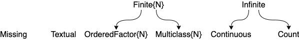

# MLJ Cheatsheet


## Starting an interactive MLJ session

```@repl cheat
using MLJ
MLJ_VERSION # version of MLJ for this cheatsheet
```

## Model search and code loading

`info("PCA")` retrieves registry metadata for the model called "PCA"

`info("RidgeRegressor", pkg="MultivariateStats")` retrieves metadata
for "RidgeRegresssor", which is provided by multiple packages

`models()` lists metadata of every registered model.

`models(x -> x.is_supervised && x.is_pure_julia)` lists all supervised models written in pure julia.

**experimental:**
`models(matching(X))` lists all unsupervised models compatible with input `X`.

**experimental!**
`models(matching(X, y))` lists all supervised modesl compatible with input/target `X/y`.

**experimental!** With additional conditions:

```julia
models() do model
    matching(model, X, y)) &&
    model.prediction_type == :probabilistic &&
	model.is_pure_julia
end
```

`tree = @load DecisionTreeClassifier` to load code and instantiate "DecisionTreeClassifier" model

`tree2  = DecisionTreeClassifier(max_depth=2)` instantiates a model type already in scope

`ridge = @load RidgeRegressor pkg=MultivariateStats` loads and
instantiates a model provided by multiple packages


## Scitypes and coercion

`scitype(x)` is the scientific type of `x`. For example `scitype(2.4) = Continuous`



type                                       | scitype
-------------------------------------------|----------------------------------
`AbstractFloat`                            | `Continuous`
`Integer`                                  | `Count`
`CategoricalValue` and `CategoricalString` | `Multiclass` or `OrderedFactor`

*Figure and Table for scalar scitypes*

Use `schema(X)` to get the column scitypes of a table `X`

`coerce(y, Multiclass)` attempts coercion of all elements of `y` into scitype `Multiclass`

`coerce(X, :x1 => Continuous, :x2 => OrderedFactor)` to coerce columns `:x1` and `:x2` of table `X`.


## Ingesting data

Splitting any table into target and input (note semicolon):

```julia
using RDatasets
channing = dataset("boot", "channing")
y, X =  unpack(channing,
               ==(:Exit),            # y is the :Exit column
               !=(:Time);            # X is the rest, except :Time
               :Exit=>Continuous,    # correct wrong scitypes
               :Entry=>Continuous,
               :Cens=>Multiclass)
```

Splitting row indices into train/validation/test:

`train, valid, test = partition(eachindex(y), 0.7, 0.2, shuffle=true, rng=1234)` for 70:20:10 ratio


## Machine construction

Supervised case:

`model = KNNRegressor(K=1)` and `mach = machine(model, X, y)`

Unsupervised case:

`model = OneHotEncoder()` and `mach = machine(model, X)`

## Fitting

`fit!(mach, rows=1:100, verbosity=1, force=false)`


## Prediction

Supervised case: `predict(mach, Xnew)` or `predict(mach, rows=1:100)`

Similarly, for probabilistic models: `predict_mode`, `predict_mean` and `predict_median`.

Unsupervised case: `transform(mach, rows=1:100)` or `inverse_transform(mach, rows)`, etc.


## Inspecting objects

`@more` gets detail on last object in REPL

`params(model)` gets nested-tuple of all hyperparameters, even nested ones

`info(ConstantRegresssor())`, `info("PCA")`, `info("RidgeRegressor",
pkg="MultivariateStats")` gets all properties (aka traits) of registered models

`info(rms)` gets all properties of a performance measure

`schema(X)` get column names, types and scitypes, and nrows, of a table `X`

`scitype(model)`, `scitype(rms)`, `scitype(X)` gets scientific type of a model, measure or table (encoding key properties)

`fitted_params(mach)` gets learned parameters of fitted machine

`report(mach)` gets other training results (e.g. feature rankings)

## Resampling strategies

`Holdout(fraction_train=…, shuffle=false)` for simple holdout

`CV(nfolds=6, shuffle=false)` for cross-validation

or a list of pairs of row indices:

`[(train1, eval1), (train2, eval2), ... (traink, evalk)]`

## Performance estimation

`evaluate(model, X, y, resampling=CV(), measure=rms, operation=predict, weights=..., verbosity=1)`
`evaluate!(mach, resampling=Holdout(), measure=[rms, mav], operation=predict, weights=..., verbosity=1)`
`evaluate!(mach, resampling=[(fold1, fold2), (fold2, fold1)], measure=rms)`

## Tuning

### Ranges for tuning

If `r = range(KNNRegressor(), :K, lower=1, upper = 20, scale=:log)` then `iterator(r, 6) = [1, 2, 3, 6, 11, 20]`

Non-numeric ranges: `r = range(model, :parameter, values=…)`.

Nested ranges: Use dot syntax, as in `r = range(EnsembleModel(atom=tree), :(atom.max_depth), ...)`

### Tuning strategies

`Grid(resolution=10)` for grid search

### Tuning model wrapper

`tuned_model = TunedModel(model=…, tuning=Grid(), resampling=Holdout(), measure=…, operation=predict, ranges=…, minimize=true, full_report=true)`


#### Learning curves

`curve = learning_curve!(mach, resolution=30, resampling=Holdout(), measure=…, operation=predict, range=…, n=1)`

If using Plots.jl:

`plot(curve.parameter_values, curve.measurements, xlab=curve.parameter_name, xscale=curve.parameter_scale)`


## Built-in performance measures

`l1`, `l2`, `mav`, `rms`, `rmsl`, `rmslp1`, `rmsp`, `misclassification_rate`, `cross_entropy`

`info(rms)` to list properties (aka traits) of the `rms` measure

`using LossFunctions` to use more measures


## Transformers

Built-ins include: `Standardizer`, `OneHotEncoder`, `UnivariateBoxCoxTransformer`, `FeatureSelector`, `UnivariateStandardizer`

Externals include: `PCA` (in MultivariateStats), `KMeans`, `KMedoids` (in Clustering).

Full list: do `models(m -> !m[:is_supervised])`


## Ensemble model wrapper

`EnsembleModel(atom=…, weights=Float64[], bagging_fraction=0.8, rng=GLOBAL_RNG, n=100, parallel=true, out_of_bag_measure=[])`


## Pipelines

With point predictions:

`pipe = @pipeline MyPipe(hot=OneHotEncoder(), knn=KNNRegressor(K=3), target=UnivariateStandardizer())`


With probabilistic-predictions:

`pipe = @pipeline MyPipe(hot=OneHotEncoder(), knn=KNNRegressor(K=3), target=v->log.(V), inverse=v->exp.(v)) is_probabilistic=true`

Unsupervised:

`pipe = @pipeline MyPipe(stand=Standardizer(), hot=OneHotEncoder())`


## Define a supervised learning network:

`Xs = source(X)`
`ys = source(y, kind=:target)`

... define further nodal machines and nodes ...

`yhat = predict(knn_machine, W, ys)` (final node)


## Exporting a learning network as stand-alone model:

Supervised, with final node `yhat` returning point-predictions:

`@from_network Composite(pca=network_pca, knn=network_knn) <= yhat`


Supervised, with `yhat` final node returning probabilistic predictions:

`@from_network Composite(knn=network_knn) <= yhat is_probabilistic=true`


Unsupervised, with final node `Xout`:

`@from_network Composite(pca=network_pca) <= Xout`
