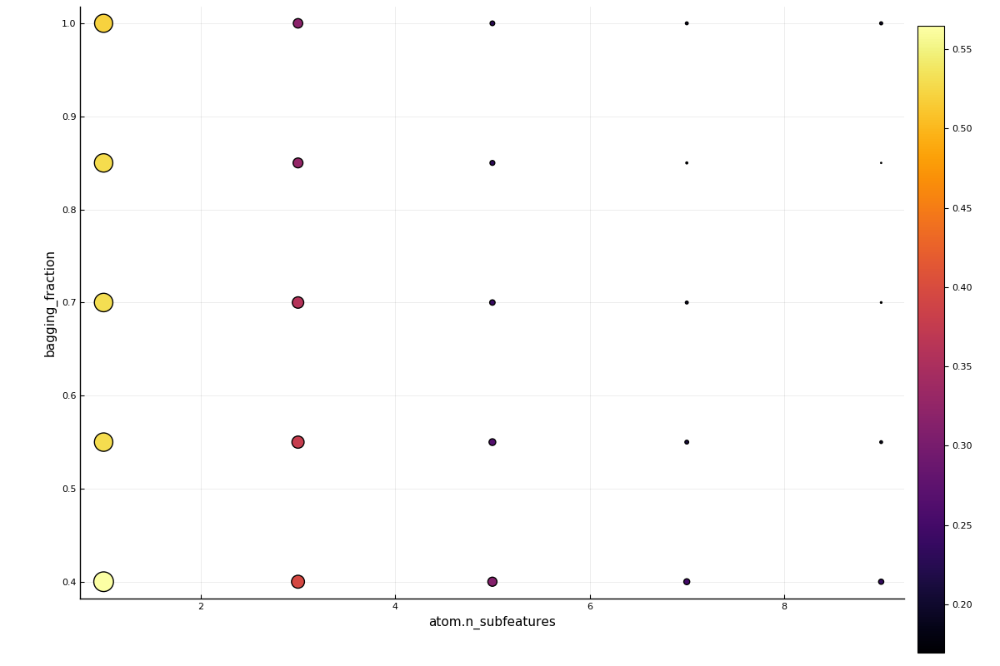
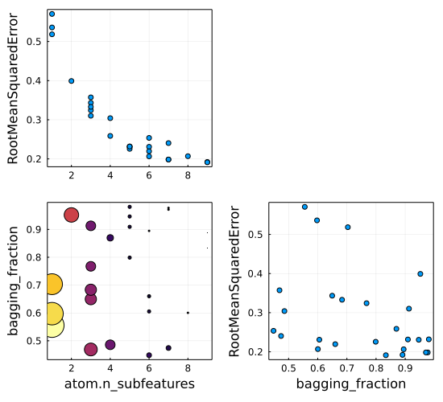
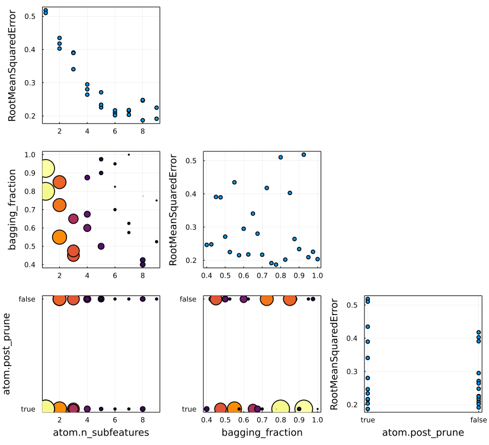

# Tuning models

Below we illustrate hyperparameter optimisation using the
[`Grid`](@ref), [`RandomSearch`](@ref) and [`LatinHypercube`](@ref)
tuning strategies.  Also available is the [tree
Parzen](https://github.com/IQVIA-ML/TreeParzen.jl) strategy; for a
complete list, see
    [here](https://github.com/alan-turing-institute/MLJTuning.jl#what-is-provided-here).

In MLJ, hyperparameter optimization, also known as model *tuning*, is
implemented as a model wrapper. After wrapping a model in a tuning
strategy and binding the wrapped model to data in a machine, `mach`,
calling `fit!(mach)` instigates a search for optimal model
hyperparameters, within a specified `range`, and then uses all
supplied data to train the best model. To predict using the optimal
model, one just calls `predict(mach, Xnew)`. In this way the wrapped
model may be viewed as a "self-tuning" version of the unwrapped model.

For in-depth overview of tuning in MLJ, or for implementation details,
see the [MLJTuning
documentation](https://github.com/alan-turing-institute/MLJTuning.jl). For
a complete list of options see the [`TunedModel`](@ref) doc-string
below.


## Tuning a single hyperparameter using a grid search (regression example)

```@example goof
using MLJ
X = MLJ.table(rand(100, 10));
y = 2X.x1 - X.x2 + 0.05*rand(100);
Tree = @load DecisionTreeRegressor verbosity=0;
tree = Tree()
```

Let's tune `min_purity_increase` in the model above, using a
grid-search. To do so we will use the simplest `range` object, a
one-dimensional range object constructed using the `range` method:

```@example goof
r = range(tree, :min_purity_increase, lower=0.001, upper=1.0, scale=:log);
self_tuning_tree = TunedModel(model=tree,
                              resampling=CV(nfolds=3),
                              tuning=Grid(resolution=10),
                              range=r,
                              measure=rms);
```

Incidentally, a grid is generated internally "over the range" by calling the
`iterator` method with an appropriate resolution:

```@example goof
iterator(r, 5)
```

Non-numeric hyperparameters are handled a little differently:

```@example goof
selector = FeatureSelector();
r2 = range(selector, :features, values = [[:x1,], [:x1, :x2]]);
iterator(r2)
```

Unbounded ranges are also permitted. See the [`range`](@ref) and
[`iterator`](@ref) docstrings below for details, and the
[`sampler`](@ref) docstring for generating random samples from
one-dimensional ranges (used internally by the [`RandomSearch`](@ref)
strategy).

Returning to the wrapped tree model:

```@example goof
mach = machine(self_tuning_tree, X, y);
fit!(mach, verbosity=0)
```

We can inspect the detailed results of the grid search with
`report(mach)` or just retrieve the optimal model, as here:

```@example goof
fitted_params(mach).best_model
```

For more detailed information, we can look at `report(mach)`, for example:

```@example goof
entry = report(mach).best_history_entry
```

Predicting on new input observations using the optimal model, *trained
on all the data* bound to `mach`:

```@example goof
Xnew  = MLJ.table(rand(3, 10));
predict(mach, Xnew)
```

Or predicting on some subset of the observations bound to `mach`:

```@example goof
test = 1:3
predict(mach, rows=test)
```

For tuning using only a subset `train` of all observation indices,
specify `rows=train` in the above `fit!` call. In that case the above
`predict` calls would be based on training the optimal model on all
`train` rows.


## A probabilistic classifier example

Tuning a classifier is not essentially different from tuning a
regressor. A common gotcha however is to overlook the distinction
between supervised models that make point predictions (subtypes of
`Deterministic`) and those that make probabilistic predictions
(subtypes of `Probabilistic`). The `DecisionTreeRegressor` model in
the preceding illustration was deterministic, so in this example will
consider a probabilistic classifier:

```@example goof
info("KNNClassifier").prediction_type
```

```@example goof
X, y = @load_iris 
KNN = @load KNNClassifier verbosity=0
knn = KNN()
```

We'll tune the hyperparameter `K` in the model above, using a
grid-search once more:

```@example goof
K_range = range(knn, :K, lower=5, upper=20);
```

Since the model is probabilistic, we need either to: (i) use a
probabilistic measure, such as `brier_loss`; or (ii) use a
deterministic measure, such as `misclassification_rate`, but declare
`operation=predict_mode` to ensure we are evaluating the measure on *point*
predictions.

**Case (i) - probabilistic measure**:

```@example goof
self_tuning_knn = TunedModel(model=knn,
                             resampling = CV(nfolds=4, rng=1234),
                             tuning = Grid(resolution=5),
                             range = K_range,
                             measure=BrierLoss());

mach = machine(self_tuning_knn, X, y);
fit!(mach, verbosity=0);
```

**Case (ii) - deterministic measure**:

```@example goof
self_tuning_knn = TunedModel(model=knn,
                             resampling = CV(nfolds=4, rng=1234),
                             tuning = Grid(resolution=5),
                             range = K_range,
                             measure=MisclassificationRate(),
                             operation=predict_mode);

mach = machine(self_tuning_knn, X, y);
fit!(mach, verbosity=0);
```

Let's inspect the best model and corresponding evaluation of the
metric in case (ii):

```@example goof
entry = report(mach).best_history_entry
```

```@example goof
entry.model.K
```

Recall that fitting `mach` also retrains the optimal
model on all available data. The following is therefore an optimal
model prediction based on all available data:

```@example goof
predict(mach, rows=148:150)
```

### Specifying a custom measure

Users may specify a custom loss or scoring function.  Suppose, for
example, we define a new scoring function `custom_accuracy` by

```@example goof
custom_accuracy(y,yhat) = mean(y .== yhat);
```

In tuning, scores are maximised, while losses are minimised. By
default, a custom measure is assumed to be a loss rather than a score,
so we must also declare

```@example goof
MLJ.orientation(::typeof(custom_accuracy)) = :score
```

For full details on constructing custom measures, see [Traits and custom
measures](@ref).

Our score is deterministic; since all measures are deterministic by
default, no further actioin is required. However, as in (ii) above, we
must declare `operation=predict_mode` to force our probabilistic model
to deliver point predictions. We'll add a second score,
`MulticlassFScore`, to evaluate (which is ignored in determining the
optimal model):

```@example goof
self_tuning_knn = TunedModel(model=knn,
                             resampling = CV(nfolds=4),
                             tuning = Grid(resolution=5),
                             range = K_range,
                             measure = [custom_accuracy, MulticlassFScore()],
                             operation = predict_mode);

mach = machine(self_tuning_knn, X, y)
fit!(mach, verbosity=0)
entry = report(mach).best_history_entry
```

```@example goof
entry.model.K
```

## Tuning multiple nested hyperparameters

The `forest` model below has another model, namely a
`DecisionTreeRegressor`, as a hyperparameter:

```@example goof
tree = Tree() # defined above
forest = EnsembleModel(atom=tree)
```

Ranges for nested hyperparameters are specified using dot syntax. In
this case we will specify a `goal` for the total number of grid
points:

```@example goof
r1 = range(forest, :(atom.n_subfeatures), lower=1, upper=9);
r2 = range(forest, :bagging_fraction, lower=0.4, upper=1.0);
self_tuning_forest = TunedModel(model=forest,
                                      tuning=Grid(goal=30),
                                      resampling=CV(nfolds=6),
                                      range=[r1, r2],
                                      measure=rms);

X = MLJ.table(rand(100, 10));
y = 2X.x1 - X.x2 + 0.05*rand(100);

mach = machine(self_tuning_forest, X, y);
fit!(mach, verbosity=0);
```

In this two-parameter case, a plot of the grid search results is also
available:

```julia
using Plots
plot(mach)
```



Instead of specifying a `goal`, we can declare a global `resolution`,
which is overriden for a particular parameter by pairing it's range
with the resolution desired. In the next example, the default
`resolution=100` is applied to the `r2` field, but a resolution of `3`
is applied to the `r1` field. Additionally, we ask that the grid
points be randomly traversed, and the the total number of evaluations
be limited to 25.

```@example goof
tuning = Grid(resolution=100, shuffle=true, rng=1234)
self_tuning_forest = TunedModel(model=forest,
                                      tuning=tuning,
                                      resampling=CV(nfolds=6),
                                      range=[(r1, 3), r2],
                                      measure=rms,
                                      n=25);
fit!(machine(self_tuning_forest, X, y), verbosity=0);
```

For more options for a grid search, see [`Grid`](@ref) below.


## Tuning using a random search

Let's attempt to tune the same hyperparameters using a `RandomSearch`
tuning strategy. By default, bounded numeric ranges like `r1` and `r2`
are sampled uniformly (before rounding, in the case of the integer
range `r1`). Positive unbounded ranges are sampled using a Gamma
distribution by default, and all others using a (truncated) normal
distribution.

```@example goof
self_tuning_forest = TunedModel(model=forest,
                                      tuning=RandomSearch(),
                                      resampling=CV(nfolds=6),
                                      range=[r1, r2],
                                      measure=rms,
                                      n=25);
mach = machine(self_tuning_forest, X, y);
fit!(mach, verbosity=0)
```

```julia
using Plots
plot(mach)
```



The prior distributions used for sampling each hyperparameter can be
customized, as can the global fallbacks. See the
[`RandomSearch`](@ref) doc-string below for details.


## Tuning using Latin hypercube sampling

One can also tune the hyperparameters using the `LatinHypercube`
tuning stragegy.  This method uses a genetic based optimization
algorithm based on the inverse of the Audze-Eglais function, using the
library
[`LatinHypercubeSampling.jl`](https://github.com/MrUrq/LatinHypercubeSampling.jl).

We'll work with the data `X`, `y` and ranges `r1` and `r2` defined
above and instatiate a Latin hypercube resampling strategy:

```@example goof
latin = LatinHypercube(gens=2, popsize=120)
```

Here `gens` is the number of generations to run the optimisation for
and `popsize` is the population size in the genetic algorithm. For
more on these and other `LatinHypercube` parameters, refer to the
[LatinHypercubeSampling.jl](https://github.com/MrUrq/LatinHypercubeSampling.jl)
documentation. Pay attention that `gens` and `popsize` are not to be
confused with the iteration parameter `n` in the construction of a
corresponding `TunedModel` instance, which specifies the total number
of models to be evaluated, independent of the tuning strategy.

```@example goof
self_tuning_forest = TunedModel(model=forest,
                                      tuning=latin,
                                      resampling=CV(nfolds=6),
                                      range=[r1, r2],
                                      measure=rms,
                                      n=25);
mach = machine(self_tuning_forest, X, y);
fit!(mach, verbosity=0)
```

```julia
using Plots
plot(mach)
```


## API

```@docs
MLJBase.range
MLJBase.iterator
MLJBase.sampler
Distributions.fit(::Type{D}, ::MLJBase.NumericRange) where D<:Distributions.Distribution
MLJTuning.TunedModel
MLJTuning.Grid
MLJTuning.RandomSearch
MLJTuning.LatinHypercube
```
