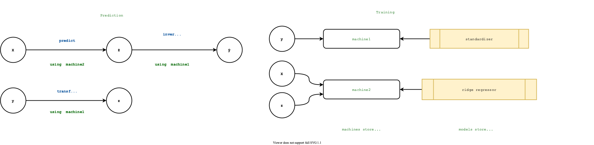

# Introduction

Statistical modelling, and the building of complex modelling
pipelines, is a cornerstone of modern data science. Most experienced
data scientists rely on high-level open source modelling toolboxes -
such as sckit-learn [@Pedregosa2001; @Buitinck2013] (Python); Weka
[@Holmes1994] (Java); mlr [@BischlEtal2016] and caret [@Kuhn2008]
(R) - for quick blueprinting, testing, and creation of
deployment-ready models. They do this by providing a common interface
to atomic components, from an ever-growing model zoo, and by providing
the means to incorporate these into complex work-flows. Practitioners
are able to build increasingly more sophisticated composite models, as
exemplified in the strategies of top contestants in Machine Learning
competitions such as Kaggle.

MLJ (Machine Learning in Julia) [@MLJ] is a toolbox written in Julia
that provides a common interface and meta-algorithms for selecting,
tuning, evaluating, composing and comparing machine model
implementations written in Julia and other languages. More broadly,
the MLJ project hopes bring cohesion and focus to a number of emerging
and existing, but previously disconnected, machine learning algorithms
and tools of high quality, written in Julia. A welcome corollary of
this activity will be increased cohesion and synergy within the
talent-rich communities developing these tools. 

In addition to
other novelties outlined below, MLJ aims to provide first-in-its-class
model composition capabilities.  Guiding goals of the MLJ project have
been usability, interoperability, extensibility, code transparency,
and reproducibility.

## Why Julia?

Nowadays, even technically competent users of scientific software will
prototype solutions using a high-level language such as python, R, or
MATLAB. However, to achieve satisfactory performance, such code typically
wraps performance critical algorithms written in a second low-level language,
such as C or FORTRAN. Through its use of an extensible, hierarchical
system of abstract types, just-in-time compilation, and by replacing
object-orientation with multiple dispatch, Julia solves the
ubiquituous "two language problem" [@BezansonEtal2017],
dramatically shrinking the innovation cycle.

As an example of the productivity boost provided by the
single-language paradigm, we cite the DifferentialEquations.jl package
[@RackauckasNie2017], which, in a few short years of
development by a small team of domain experts, became the best package
in its class [@Rackauckas2017].

Another major advantange of a single-language solution is the ability to
automatically differentiate (AD) functions from their code
representations. The Flux.jl package [@Innes2018], for example,
already makes use of AD to allow unparalleled flexibility in neural
network design .

As a new language, Julia is high-performance computing-ready, and its
superlative metaprogramming features allow developers to create
domain-specific syntax for user interaction. 

## Novelties

In line with current trends in "auto-ML", MLJ's design is largely
predicated on the importance of model composability. Composite models
share all the behaviour of regular models, constructed using a new
flexible "learning networks" syntax. Unlike the toolboxes cited above,
MLJ's composition syntax is flexible enough to define stacked models,
with out-of-sample predictions for the base learners, as well as more
routine linear pipelines, which can include target transformations
that are learned. As in mlr, hyper-parameter tuning is implemented as
a model wrapper.

In MLJ, probabilistic prediction is treated as a first class feature,
leveraging Julia's type sytem. In particular, unnecessary
case-distinctions, and ambiguous conventions regarding the representation
of probabilities, are avoided.

A user can connect models directly to tabular data in a manifold of
in-memory and out-of-memory formats, and usability is enhanced through
the introduction of "_scientific types_" allowing the user to focus
on the intended purpose of data ("continous", "ordered factor", etc)
rather than particular machine type representations.

Finally, with the help of scientific types and the CategoricalArrays
package [@CategoricalArrays], users are guided to create safe
representations of categorical data, in which the complete pool of
possible classes is embedded in the data representation (and
classifiers preserve this information when making predictions!). This
avoids a pain-point familiar in environments that simply recast
categorical data using integers (e.g., scikit-learn): evaluating a
classifier on the test target, only to find the test data includes
classes not seen in the training data. Preservation of the original
labels for these classes also facilitates exploratory data anaysis and
interpretability.

# Scientific types

To help users focus less on data representation (e.g., `Float32`,
`CategoricalValue{Char,UInt8}` or `DataFrame`) and more on intended
*interpretation* (such as, "continuous", "ordered factor" and
"table") MLJ articulates model data requirements, as well as data
pre-processing tasks, using *scientific types*. A scientific type is
an ordinary Julia type (generally without instances) reserved for
indicating how some data should be interpreted.


Some of these types (provided by an external package for re-use
elsewhere) are shown in \autoref{fig1}.

<!--  -->


To the scientific types, MLJ adds a specific *convention* specifying a
scientific type for every Julia object. The convention is expressed
through a single method `scitype`.  A `coerce` method to recasts
machine types so that they have the desired scientific type
(interpretation), and a `schema` summmarizes the machine and scientfic
types of tabular data.

```julia
using MLJ, CategoricalArrays
scitype(1.2)
```
```
Continuous
```

```julia
table = (age=[20, 13, 48], attempts=[10, 5, 6], query=["why", "what", "whom"])
schema(table)
```
```
┌──────────┬─────────┬────────────┐
│ _.names  │ _.types │ _.scitypes │
├──────────┼─────────┼────────────┤
│ age      │ Int64   │ Count      │
│ attempts │ Int64   │ Count      │
│ query    │ String  │ Textual    │
└──────────┴─────────┴────────────┘
_.nrows = 3
```

```julia
fixed_table = coerce(column_table, :age=>Continuous, :query=>Multiclass)
schema(fixed_table)
```
```
┌──────────┬───────────────────────────┬───────────────┐
│ _.names  │ _.types                   │ _.scitypes    │
├──────────┼───────────────────────────┼───────────────┤
│ age      │ Float64                   │ Continuous    │
│ attempts │ Int64                     │ Count         │
│ query    │ CategoricalString{UInt32} │ Multiclass{3} │
└──────────┴───────────────────────────┴───────────────┘
_.nrows = 3
```

Since scientific types are also Julia types, Julia's advanced type
system means scientific types can be organized in a type hierarchy,
and it is straightforward to check the compatibility of data with a
model's scientific requirements and methods can be dispatched on
scientific type just as they would on ordinary types.

# Connecting models directly to arbitrary data containers

MLJ models generally expect features (and multivariate target data) to
be tabular (rather than a raw matrix, for example). While there are
many options for storing tabular data in Julia, both in memory or on
disk, these can be accessed using a common interface provided by the
Tables.jl package [@Quinn]. In MLJ, any Tables.jl-compatible table has
scientific type `Table{K}`, where the type parameter `K` is the union
of the column scientific types; most models allow scientific type for
input features to be some subtype of `Table`.

While internally many models convert tabular data to matrices, a
lightweight table wrapper for matrices provided by Tables.jl means
that type coercion is skipped by the compiler in the case of matrix input
(as readily verified using Julia's code inspection macro
`@code_llvm`).

# Finding the right model

A model registry gives the user access to model metadata without the
need to actually load code defining the model implementation. This
metadata includes the model's data requirements (framed in terms of
scientific types), the names and types of hyper-parameters, a brief
document string, the url for the providing package, open source
license and a load path to enable MLJ to locate the model interface
code.

Such information allows users to match models to machine learning
tasks, facilitating searches for an optimal model. For example, to find
all supervised models making probabilistic predictions, compatible
with input data `X` and target `y`, one defines a filter

```julia
task(model) = matching(model, X, y) && model.prediction_type ==
:probabilistic models(task) 

```

and lists the models with `models(task)`. 

# Flexible and compact work-flows for performance evaluation and tuning

Evaluating the performance of some `model` object (specifying the
hyper-parameters of some supervised learning algorithm) using some
specified `resampling` strategy, and measured against some battery of
performance `measures`, looks like this:

```julia
evaluate(model, X, y, resampling=CV(nfolds=6), measures=[L2HingeLoss(), BrierScore()])

┌──────────────────────────────┬───────────────┬────────────────────────────────────────────────┐
│ _.measure                    │ _.measurement │ _.per_fold                                     │
├──────────────────────────────┼───────────────┼────────────────────────────────────────────────┤
│ L2HingeLoss                  │ 1.4           │ [0.485, 1.58, 2.06, 1.09, 2.18, 1.03]          │
│ BrierScore{UnivariateFinite} │ -0.702        │ [-0.242, -0.788, -1.03, -0.545, -1.09, -0.514] │
└──────────────────────────────┴───────────────┴────────────────────────────────────────────────┘
```

As in mlr, hyper-parameter optimization is realized as a model
wrapper, which transforms a base model into a "self-tuning" version of
that model. That is, tuning is is abstractly specified before being
executed. This allows tuning to be integrated into work-flows (learning
networks) in multiple ways. A well-documented tuning interface
[@MLJTuning] allows developers to easily extend available
hyper-parameter tuning strategies.

We now give an example of syntax for wrapping a model called
`forest_model` in a random search tuning strategy, using
cross-validation, and optimizing the mean square loss. The `model` in
this case is a composite model with an ordinary hyper-parameter called
`bagging_fraction` and a *nested* hyper-parameter `atom.n_subfeatures`
(where `atom` is another model). The first two lines of code define
ranges for these parameters.

```julia
r1 = range(forest_model, :(atom.n_subfeatures), lower=1, upper=9)
r2 = range(forest_model, :bagging_fraction, lower=0.4, upper=1.0)
self_tuning_forest_model = TunedModel(model=forest_model,
                                      tuning=RandomSearch(),
                                      resampling=CV(nfolds=6),
                                      range=[r1, r2],
                                      measure=LPDistLoss(2),
                                      n=25)
```

In this random search example default priors are assigned to each
hyper-parameter but options exist to customize these. Both resampling
and tuning have options for parallelization; Julia has first class
support for both distributed and multi-threaded parallelism.

# A unified approach to probabilistic predictions and their evaluation

MLJ puts probabilistic models and deterministic models on equal
footing. Unlike most most frameworks, a supervised model is either
*probablistic* - meaning it's `predict` method returns a sampler
object - *or* it is *deterministic* - meaning it returns objects of
the same scientific type as the training observations. To use a
probabilistic model to make deterministic predictions one can easily
wrap the model in a pipeline with an appropriate post-processing
function, or use additional `predict_mean`, `predict_mean`,
`predict_mode` methods to deal with the common use-cases.

The "sampler" objects returned by a probabilistic predictor are
objects that can be sampled using Julia's `rand` method. Where
possible the object is in fact a `Distribution` object from the
Distributions.jl package [@LinEtal2020], for which an additional `pdf`
method for evaluating the distribution's probability density or mass
function is implemented, and which will generally implement a `mode`
method or `mean` and `median` or methods (allowing MLJ's
fallbacks for `predict_mean`, etc, to work). 

One important distribution *not* provided by Distributions.jl is a
distribution for finite *labeled* data (called `UnivariateFinite`)
which additionally tracks all possible classes of the categorical
variable it is modelling, and not just those observed in training
data.

By predicting distributions, instead of raw probablities or
parameters, MLJ avoids a common pain point, namely deciding and
agreeing upon a convention about how these should be represented:
Should a binary classifier predict one probability or two? Are we
using the standard deviation or the variance here? What's the
protocol for deciding the order of (unordered) classes? How should
multi-target predictions be combined?, etc.

A case-in-point concerns performance measures (metrics) for
probabilistic models, such as cross-entropy and Brier loss. All
built-in probablisitic measures provided by MLJ are passed
a distribution in their prediction slot.

For an overview on probabilistic supervised learning we refer to
[@Gressmann2018].

# Model interfaces

MLJ provides a basic `fit/update/predict` interface to be implemented
by new supervised models. For unsupervised models `predict` is
replaced with `transform` and an optional `inverse_transform`
method. These methods operate on *models* which are mutable structs
storing hyper-parameters, and nothing else. This *model interface* is
purely functional for maximum flexibility. Presently the general MLJ
user is encouraged to interact through a *machine interface* sitting
on top. See more on this below.

## The model interface

In MLJ a *model* is just a struct storing the hyper-parameters
associated with some learning algorithm suggested by the struct name
(e.g., `DecisionTreeClassifier`), and that is all. In the low-level,
functional-style, model interface *learned parameters* are not stored,
only passed around. Learned parameters *are* stored in machines (which
additionally *point* to the hyperparameters stored in a model); see
below.  The separation of hyper-parameters and learned parameters is
essential to flexible model composition.

For supervised models the `fit` method has this signature:

```julia
fit(model, verbosity, X, y)
```

where `X` is training input and `y` the training target. The method
outputs a triple, typically denoted `(fitresult, cache,
report)`.

The `fitresult` stores the learned parameters, which must
include everything needed by `predict` to make predictions, apart
from `model` and new input data:

```julia
predict(model, fitresult, X)
```

The purpose of `cache` is to pass on "state" not included in the
`fitresult` to an `update` method that the model implementer may
optionally overload:

```julia
update(model, verbosity, fitresult, cache, X, y)
```

This method is to be called instead of `fit` (and passed the
`fitresult` and `cache` returned by the `fit` call) when retraining
using identical data. (The data `X`, `y`, are included for implementer
convenience.)  It provides an opportunity for the model implementer to
avoid unnecessary repetition of code execution. The three main
use-cases are:

- **Iterative models.** If the only change to a random forest model is
  an increase in the number of trees by ten, for example, then not all
  trees need to be retrained; only ten new trees need to be
  trained. If a "self-tuning" model has been fit (i.e., tuned) using
  70 iterations of Tree Parzen optimization, then adding 20 more
  iterations should build on the existing surrogate objective
  function, not ignore the existing tuning history.

- **Data preprocessing.** Avoid overheads associated with data
  preprocessing, such as coercion of data into an algorithm-specific
  type.

- **Smart training of composite models.** When tuning a simple
  transformer-predictor pipeline model using a holdout set, for
  example, it is unecessary to retrain the transformer if only the
  predictor hyper-parameters change. MLJ implements "smart" retraining
  of composite models like this by defining appropriate `update`
  methods.

In the future MLJ will add an `update_data` method to support
models that can cary out on-line learning.

## The machine interface

The general MLJ user trains models through its machine interface. This
makes some work-flows more convenient, but more significantly,
introduces a syntax closely aligned with that for model composition
(see below).

A *machine* is a mutable struct that binds a model to data at construction

```julia
mach = machine(model, X, y)
```

When the user calls `fit!(mach, rows=...)` the `fitresult`, `cache`
and `report` variables generated by lower-level calls to `fit` or
`update`, are stored or updated in the machine struct, `mach`, with
the training being optionally restricted to the specified rows of
data.  To retrain with new hyper-parameters, the user simply mutates
`model` and repeats the `fit!` call.

Syntax for predicting using a machine is `predict(mach, Xnew)`.

# Flexible model composition

Several limitations surrounding model composition are increasingly
evident to users of the dominant machine learning software
platforms. The basic model composition interfaces provided by the
toolboxes mentioned in the Introduction all share one or more of the
following shortcomings, which do not exist in MLJ:

- Composite models do not inherit all the behavior of ordinary
  models.

- Composition is limited to linear (non-branching) pipelines.

- Supervised components in a linear pipeline can only occur at the
  end of the pipeline.

- Only static (unlearned) target transformations/inverse
  transformations are supported.

- Hyper-parameters in homogeneous model ensembles cannot be coupled.

- Model stacking, with out-of-sample predictions for base learners,
  cannot be implemented.

- Hyper-parameters and/or learned parameters of component models are
  not easily inspected or manipulated (in tuning algorithms, for
  example)

We now sketch MLJ's composition API, referring the reader to
[@Blaom_I] for technical details, and to the MLJ documentation
[@MLJdocs; @MLJtutorials] for examples that will clarify how the
composition syntax works in practice.

Note that MLJ also provides "canned" model composition for common use
cases, such as non-branching pipelines and homogeneous ensembles,
which are not discussed further here.

Specifying a new composite model type is in two steps, *prototyping*
and *export*.

## Prototyping

In prototyping the user defines a so-called *learning network*, by
effectively writing down the same code she would use if composing the
models "by hand". She does this using the machine syntax, with which
she will already be familiar, from the basic `fit!`/`predict`
work-flow for single models. There is no need for the user to provide
production training data in this process. A dummy data set suffices,
for the purposes of testing the learning network as it is built.

<!--  -->


The left side of \autoref{fig2} illustrates a simple learning network
in which a continuous target `y` is "normalized" using a learned Box
Cox transformation, producing `z`. Ridge regression is applied to
input features `X` to make a target prediction `ẑ`, which is not the
final overall prediction of the network, as the ridge regressor is to
be trained using the *transformed* target `z` (see right). Rather, the
final prediction `ŷ` is the inverse Box Cox transform of `z`.

The right "training" side of the figure shows the two machines which
will store the parameters learned in training - the Box Cox exponent
and shift (`machine1`) and the ridge model coefficients
(`machine2`). The diagram additionally indicates where the machines
should look for training data, and where to accesses model
hyper-parameters (stored in `box_cox` and `ridge_regressor`).

The only syntactic difference between composing "by hand" and building
a learning network is that the training data must be wrapped in
"source nodes" (which can be empty if testing is not required). Each
data "variable" in the manual workflow becomes instead a node of a
directed acyclic graph encoding the composite model
architecture. Nodes are callable, with a node call triggering lazy
evaluation of the `predict`, `transform` and other operations in the
network. Instead of calling `fit!` on every machine, a single call to
`fit!` on a *node* triggers training of all machines needed to call
that node, in appropriate order. As mentioned earlier, training such a
node is "smart" in the sense that hyper-parameter changes to a model
only trigger retraining of necessary machines. So, for example, there
is no need to retrain the Box Cox transformer in the preceding example
if only the ridge regressor hyper-parameters have changed.

The syntax, then, for specifying the learning network shown
\autoref{fig2} looks like this:

```julia
X = source(X_dummy)                # or just source()
y = source(y_dummy, kind=:target)  # or just source(kind=:target)

machine1 = machine(box_cox, y)
z = transform(machine1, y)

machine2 = machine(ridge_regressor, X, z)
ẑ = predict(machine2, X)
ŷ = inverse_transform(machine1, ẑ)

fit!(ŷ)  # to test training on the dummy data
ŷ()      # to test prediction on the dummy data
```

Note that the machine syntax is a mechanism allowing for multiple
nodes to point to the same learned parameters of a model, as in
the learned target transformation/inverse transformation above. They
also allow multiple nodes to share the same model (hyper-parameters) as
in homogeneous ensembles. And different nodes can be accessed during
training and "prediction" modes of operation, as in stacking.

## Export

In the second step of model composition, the learning network is
"exported" as new stand-alone composite model type, with the component
models appearing in the learning network becoming default values for
corresponding hyper-parameters (whose values are themselves
models). This new type (which is unattached to any particular data)
can be instantiated and used just like any other MLJ model (tuned,
evaluated, etc). Under the hood, training such a model builds a
learning network, so that training is "smart". Defining a new
composite model type requires generating and evaluating code, but this
is readily implemented using Julia's meta-programming tools, i.e.,
executed by the user with a simple macro call.

# Future directions

Here is a selection of future work planned or in progress:

- **Supporting more models**. Proofs of concept already exist for
  interfacing pure-Julia deep learning and probabilistic programming models.

- **Enhancing core functionality.** Add more tuning
   strategies, in particular, Bayesian methods and AD-powered gradient
   descent.

- **Broadening Scope.** Adding resampling strategies and tools for
   dealing with time series data, and for dealing with sparse data
   relevant in natural language processing.

- **Scalability.** Add DAG scheduling for learning network training

A more comprehensive road map is linked from the MLJ repository [@MLJ].

# Acknowledgements

We acknowledge valuable conversations with Avik Sengupta, Mike Innes,
mlj author Bernd Bischl, and IQVIA's Yaqub Alwan and Gwyn Jones. Seed
funding for the MLJ project has been provided by the Alan Turing
Institute's Tools, Practicies Systems programme, with special thanks
to Dr James Hethering, its former Programme Director, and Katrina
Payne. Mathematics for Real-World Systems Centre for Doctoral Training
at the University of Warwick provided funding for students exploring
the Julia ML ecosystem, who created an intial proof-of-concept.

**Code contributors.** D. Aluthge, D. Arenas, E. Barp, C. Bieganek,
A. Blaom, G. Bohner, M. K. Borregaard, D. Buchaca, V. Churavy,
H. Devereux, M. Giordano, J. Hoffimann, T. Lienart, M. Nook,
Z. Nugent, S. Okon, P. Oleśkiewicz, J. Samaroo, A. Shridar,
Y. Simillides, A. Stechemesser, S. Vollmer

# References